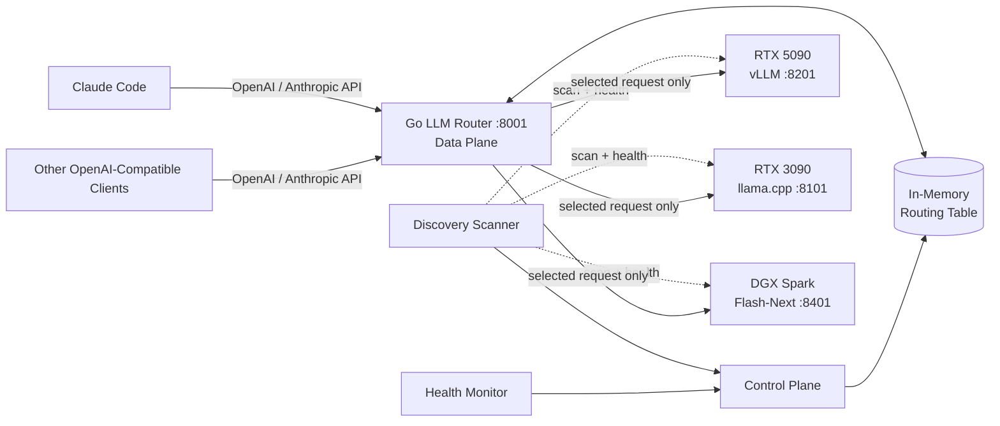
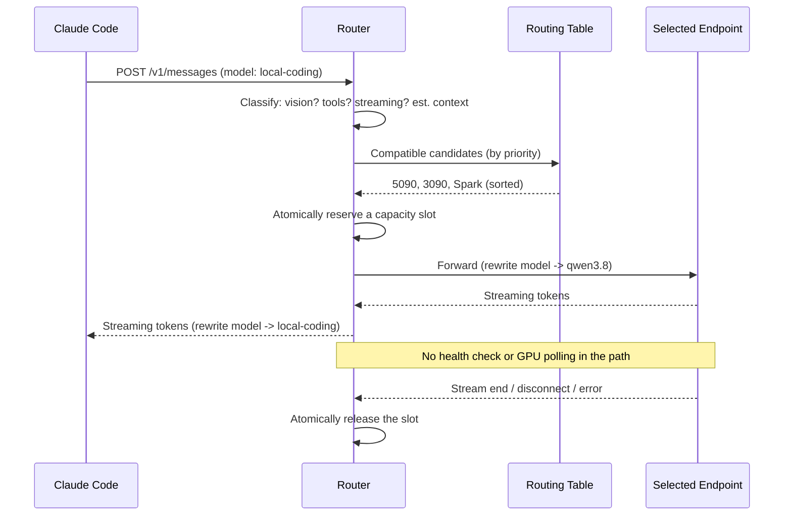

# HomeAILab — Qwen3.8-27B GPU Inference Fleet

A working, single-user GPU inference fleet that serves **Qwen3.8-27B** (abliterated
"Uncensored") and a **180B MoE** vision model across three heterogeneous machines,
fronted by a custom **Go LLM router** that gives any OpenAI- or Anthropic-compatible
client (including Claude Code) a single, deterministic endpoint. Everything is
deployed through **Portainer** stacks — the YAMLs in this repo are the source of
truth you maintain in the Portainer UI.

> **If this helps, give it a star.** It's the difference between a project and a
> reference.

---

## The fleet in one line

| Host | GPU | Role |
|---|---|---|
| **RedPCv2** (`.37`) | RTX 5090 (32 GB) | vLLM, fastest text decode |
| **Databrick** (`.48`) | RTX 3090 (24 GB) | llama.cpp, MTP spec decode, 262K verified |
| **DGX Spark** (`.39`) | NVIDIA GB10 (122 GB unified) | NVFP4 vLLM + 180B MoE vision (Flash-Next) |

A deterministic router on Databrick (`:8001`) cascades **5090 → 3090 → Spark**,
pins vision requests to the Spark, and gives each client a stable
`local-coding` alias that transparently maps to the backend's `qwen3.8`.

---

## How it works

### High-level architecture



### The request hot path

The router is single-process, no DB, no Redis. The request path is a pure
in-memory filter + atomic capacity reserve — it never touches the network except
to forward to the selected backend.



Routing is **deterministic priority**: 5090 (prio 10) → 3090 (prio 20) → Spark
(prio 30). Context selection prefers the **smallest sufficient** context class.
Vision requests are pinned to the only `vision:true` endpoint (the Spark). If a
lower-priority backend is full, the router fails over **before** the first byte
streams; once bytes are flowing, no silent migration.

---

## The 5090 is the speed king 👑

The RTX 5090 (RedPCv2) is the **fastest backend in the fleet** and the primary
target for high-throughput text workloads. The live stack (`backends/rtx5090/RTX5090DSAMPL.yaml`,
Portainer endpoint 5, stack 23) runs the **Huihui Qwen3.8-27B Abliterated NVFP4**
model at 262,144-token context with vLLM 0.28.0 + the SM120 NVFP4/XQA patch stack.

| Metric | Value |
|---|---|
| **Sustained decode** | **~120–130 tok/s** (peak 124.9 tok/s observed; sustained ~120 tok/s across long generations) |
| **MTP speculative decoding** | ON, 4 draft tokens; mean acceptance length 3.3–5.0; peak acceptance rate 100% at position 1 |
| **Prefix cache hit rate** | ~84% (rising from ~47% early in the session to 84%+ as the session caches warm) |
| **Prompt prefill** | ~2,000–54,000 tok/s (chunked prefill, 4,096-token chunks) |
| **KV cache** | NVFP4 4-bit, explicit 7 GiB budget (~319,339 tokens of KV at max concurrency 1.22× the 262,144 limit) |
| **Weight format** | compressed-tensors NVFP4 W4A4 (19.15 GiB checkpoint, ~20 GB) |
| **Patch stack** | SM120 NVFP4 KV + XQA decode + MTP drafter CUDA graphs (pinned to commit `dd6801e`) |
| **Model source** | `sakamakismile/Huihui-Qwen3.8-27B-abliterated-NVFP4` on HuggingFace (credit: huihui-ai) |

> **Why the 5090 is this fast:** the SM120 patch stack installs an NVFP4 KV-cache
> kernel overlay compiled for `sm_120a` (RTX 5090 Blackwell). FlashInfer handles
> attention + sampling; XQA accelerates the speculative-verification path. The
> MTP head (BF16) in the checkpoint is used for n=4 speculative decoding, and
> prefix caching (84% hit) keeps repeated system prompts essentially free.
> Result: a single-user workstation profile (`--performance-mode interactivity`)
> that sustains **~120+ tok/s** while keeping ~2.75 GiB VRAM headroom for the
> desktop OS.

---

## Fleet (backends)

| Backend | Device | GPU | Engine | Model | Quant | Port | Context | Cap | Measured |
|---|---|---|---|---|---|---|---|---|---|
| `qwen38-vllm-5090` | RedPCv2 | RTX 5090 32 GB | vLLM `0.28.0` + SM120 NVFP4/XQA | Huihui Qwen3.8-27B-abliterated | `compressed-tensors NVFP4 W4A4`, KV nvfp4 | `:8201` | 262 144 | 1 (router) | **~120–130 tok/s** (MTP n=4, 84% prefix-cache hit) |
| `qwen38-27b-3090` | Databrick | RTX 3090 24 GB | llama.cpp `server-cuda12` | Qwen3.8-27B-Uncensored | `Q4_K_M` (fused MTP) | `:8101` | 262 144 | 1 | ~60 tok/s decode (MTP 1.47x) |
| `qwen38-27b-dgxsparx` (27B) | DGX Spark | GB10 122 GB | vLLM `arm64-cu13 0.25.1` | Qwen3.8-27B-Uncensored | `modelopt_fp4` | `:8401` | 262 144 | 3 (router) | ~165 tok/s @16 wide |
| `qwen38-flashnext-dgxsparx` | DGX Spark | GB10 122 GB | ds4 SSD-PLE (Flash-Next) | Qwen3.8-Flash-Next 180B MoE | `q6-ssd-ple-bf16` | `:8401` | 262 144 | 3 | vision; ~60–120 s cold TTFT |

**Why the 3090 runs 262K on 24 GB:** Qwen3.8 is a hybrid linear+full-attention
model — only 16 of 64 layers are full-attention, so 262K-context KV is tiny
(~4 GiB in q4_0). The 3090 build uses built-in **MTP speculative decode**
(`--spec-type draft-mtp --spec-draft-n-max 3`), ~60 tok/s decode, ~0.2 s TTFT.

**Spark caveat:** the Flash-Next SSD-PLE has a ~60–120 s cold TTFT (slow
SSD-PLE prefill, ~1 tok/s). The router's upstream response-header timeout is
raised to 180 s so the slow prefill can emit a first byte before the router
declares a pre-stream failure.

The router only reads the 5090's `/health` + `/metrics` and proxies to it.
Router-side static capacity is 1 even though the live vLLM runs `--max-num-seqs 1`
(mirror of the router cap). The 5090 stack is actively maintained through the
SM120 NVFP4/XQA patch stack — not "untouched" — see the call-out above.

---

## Port ranges (the permanent contract)

Inference runtimes live **only** inside their assigned port contract; a runtime
outside its range must not enter the routing table. The router enforces this.

| Runtime / Service | Port range | Purpose |
|---|---:|---|
| Router API | 8000-8009 | Router ingress + admin (router binds **8001**; 8000 = Portainer) |
| llama.cpp | 8100-8199 | llama.cpp model instances |
| vLLM | 8200-8299 | vLLM model instances |
| SGLang | 8300-8399 | SGLang model instances |
| Vision-specialized | 8400-8499 | Dedicated VLM / vision endpoints |
| Embeddings / rerankers | 8500-8599 | Embedding + reranker services |
| Metrics / exporters | 9000-9099 | Prometheus metrics (Portainer API on 9000) |
| Management | 9100-9199 | Router/admin sidecars |

This fleet's live assignments: router `:8001`, 3090 llama `:8101`, 5090 vLLM
`:8201`, Spark vision `:8401`. Every one sits inside its contract.

---

## Models

| Model | Variant | Quant | Size | Where it runs |
|---|---|---|---|---|
| Qwen3.8-27B-Uncensored | 27B dense, abliterated, MTP head | `Q4_K_M` (GGUF, fused MTP) | 16.8 GiB | 3090 (llama.cpp) |
| Qwen3.8-27B-Uncensored | 27B, MTP-grafted | `NVFP4` (ModelOpt) | 19 GB + 0.8 GB head | 5090 + Spark (vLLM) |
| **Huihui Qwen3.8-27B-abliterated** | 27B abliterated, MTP head preserved in BF16 | `compressed-tensors NVFP4 W4A4` | 19.15 GiB | **5090 (vLLM 0.28.0 + SM120 NVFP4/XQA)** |
| Qwen3.8-Flash-Next | 180B MoE, native vision (Qwen tower) | `q6-ssd-ple-bf16` (Baekpica ds4) | ~100 GB SSD-PLE | Spark (ds4, vision) |

All backends advertise `max_model_len 262144`. A true 258K-token prompt has been
verified through the router. The Spark shares its 262K pool across 3 router
slots, so a request that must spill to a full Spark gets ~87K per stream —
mitigated by `CLAUDE_CODE_AUTO_COMPACT_WINDOW` in the launchers.

---

## The router (Go)

`router/` is a single Go 1.24 binary (stdlib + `gopkg.in/yaml.v3`), built to a
scratch image `local/llm-router:1.0.0` (~9.9 MB), deployed on Databrick via the
Portainer stack `router/llm-router-stack.yaml` (endpoint 3).

- **Endpoints** (seeded, see `router/config/router.yaml`):
  - `rtx5090-qwen38-262k-01` → `:8201` (vLLM, prio 10, cap 1)
  - `rtx3090-qwen38-262k-01` → `:8101` (llama.cpp, prio 20, cap 1)
  - `dgxspark-flashnext-262k-01` → `:8401` (Flash-Next, prio 30, cap 3, vision)
- **Public alias:** `local-coding` → backend `qwen3.8` (router rewrites the
  request and response `model` field).
- **3 API families:** OpenAI `/v1/chat/completions`, Anthropic `/v1/messages`,
  plus `/v1/messages/count_tokens`, `/router/status`, `/admin/*`, `/health`,
  `/metrics`.
- **Capacity:** static atomic reservations (5090=1, 3090=1, Spark=3). At max
  capacity the router returns a controlled **503 `CAPACITY_FULL`**, then
  recovers as in-flight requests finish.
- **Hot path:** no health check, no GPU poll, no Prometheus/Docker/Portainer
  query per request.

Build / test: `cd router && go test ./...` (capacity, routing, streaming, api).
Rebuild image + redeploy: see `router/scripts/` (`build.sh`,
`portainer-deploy.sh`, `validate.sh`).

---

## Getting started

### 1. Configure

Copy `.env.example` to `.env` and fill in your lab's values (host IPs, Portainer
creds, router API key, UI creds). Every committed YAML, script, and launcher
reads from `.env` — no secrets are stored in the repo.

### 2. Point Claude Code at the router

Run a launcher (reads `ROUTER_API_KEY` + `HOST_*` from `../.env`):

```
launchers\claude-router.bat      # deterministic router (:8001, alias local-coding)
launchers\claude-direct5090.bat  # rollback: talk to the 5090 vLLM directly (:8201)
launchers\claude-cluster.bat     # legacy 3-backend dynamic router (:8010)
```

`claude-router.bat` probes `/health` before launching and routes all Claude Code
model roles to the `local-coding` alias.

### 3. Deploy / redeploy a backend (Portainer API)

All stacks deploy through the Portainer REST API (server on Databrick, `:9000`).
Login → JWT → `POST /api/endpoint/<id>/stacks/create/standalone/string`. The
scripts in `qwen3.8-27b/` (`deploy_router.sh`, `deploy_spark.sh`, `redeploy.sh`)
and `router/scripts/portainer-deploy.sh` wrap this. Re-deploy = delete stack by
name + recreate (Portainer upsert does not recreate on env-only changes).

### 4. Monitoring

Prometheus + Grafana run on the DGX Spark. Editable copies live in
`monitoring/` (`prometheus.yml` + the `adrsc9f` dashboard, with a `device`
filter). See `monitoring/README.md` for the Grafana 13 Unified-Storage write
gotcha.

---

## Repo layout

```
modeloptimizer/
├── README.md / CLAUDE.md / AGENTS.md / .env(.example)
├── backends/
│   ├── rtx3090/          qwen38-27b-3090-v1/v2.yaml
│   ├── rtx5090/          RTX5090DSAMPL.yaml (vLLM reference)
│   └── dgxspark/         qwen38-27b-dgxsparx-v1/v2-nvfp4 + qwen38-flashnext-*
├── router/               the Go LLM router (source of truth)
├── router-legacy/        the retired Python 3-backend router (:8010)
├── archive/              superseded router v1 / UI / status YAMLs + sample
├── monitoring/           prometheus.yml + Grafana dashboard + README
├── launchers/            claude-router / claude-direct5090 / claude-cluster .bat
├── scripts/              spark_bench*.sh, start-5090-wsl.ps1
├── qwen3.8-27b/          tuning + bench scripts (tune.sh, sweep_*.sh, redeploy.sh)
├── llmbench/             self-contained benchmark project
├── video/                self-contained Vite/React fleet-animation project
└── docs/                 LLM_ROUTER_IMPLEMENTATION_HANDOFF.md, architecture.md, RESULTS.md
```

`archive/` is history — don't edit it. The `video/` project is self-contained
(it carries a LAN IP in its source, by design for the lab LAN).

---

## Deep reading

- [`docs/LLM_ROUTER_IMPLEMENTATION_HANDOFF.md`](docs/LLM_ROUTER_IMPLEMENTATION_HANDOFF.md)
  — the authoritative, prescriptive router spec (control vs data plane, static
  atomic capacity, deterministic priority, pre-stream-only failover).
- [`docs/ultra_fast_local_llm_router_architecture.md`](docs/ultra_fast_local_llm_router_architecture.md)
  — the reference architecture: port contracts, capability signatures, the
  capacity state machine, the Spark layout.
- [`docs/RESULTS.md`](docs/RESULTS.md) — the 3090 262K MTP deployment writeup.

---

*If this saved you a weekend of GPU-fleet plumbing, a star is appreciated.*
