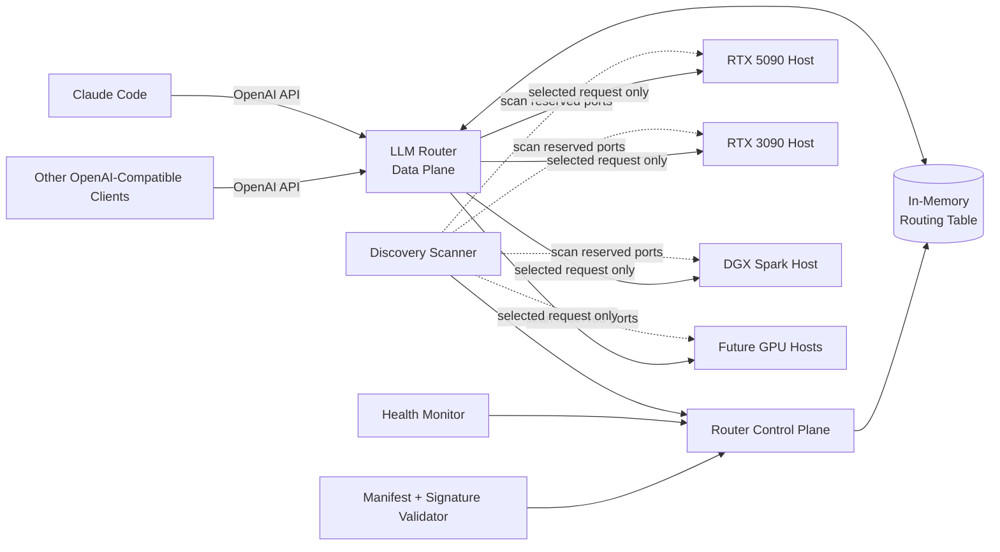
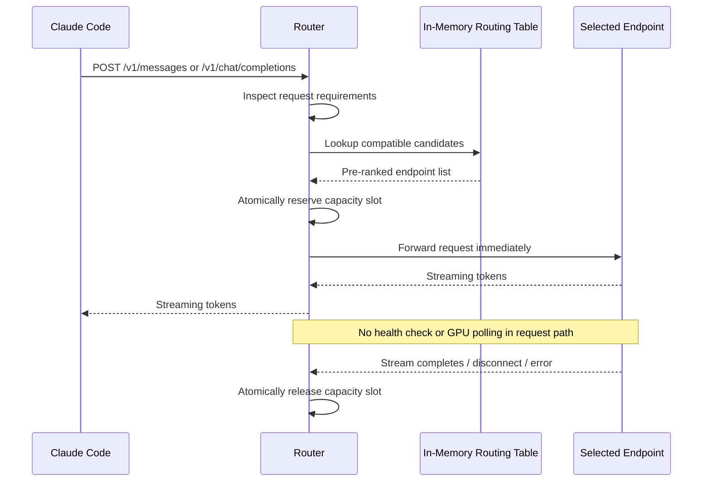
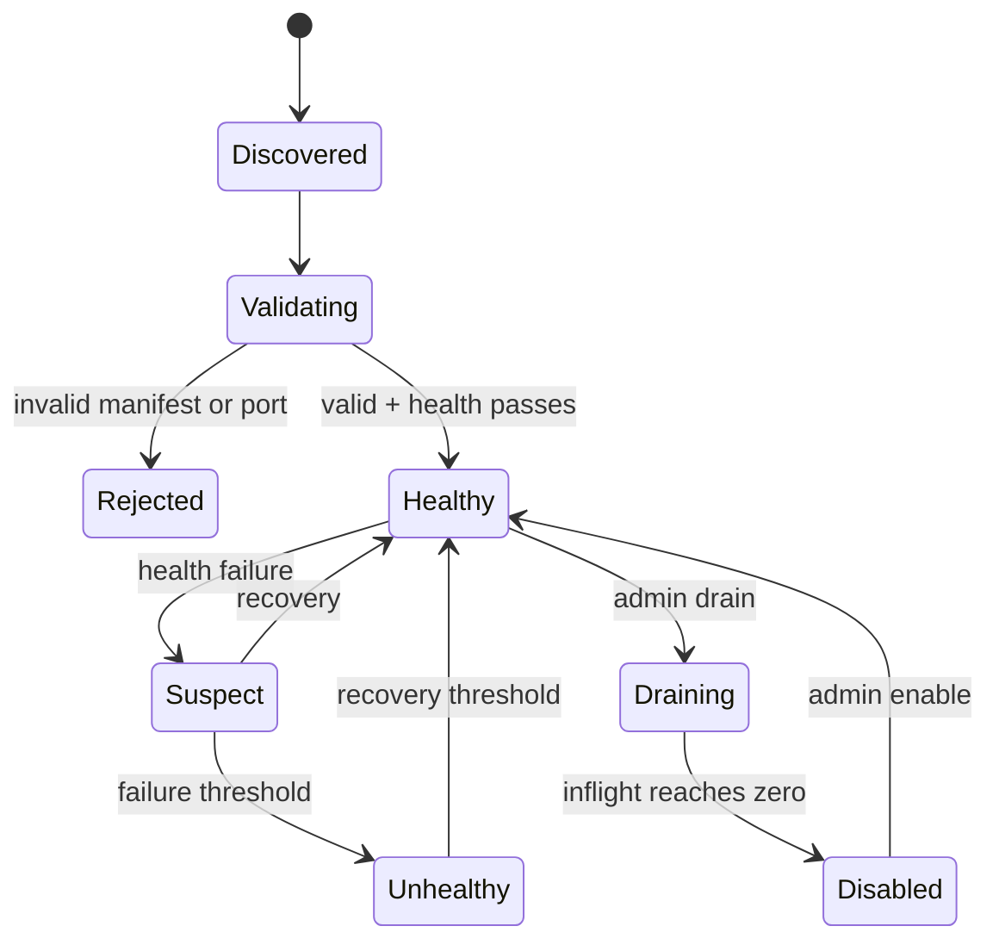
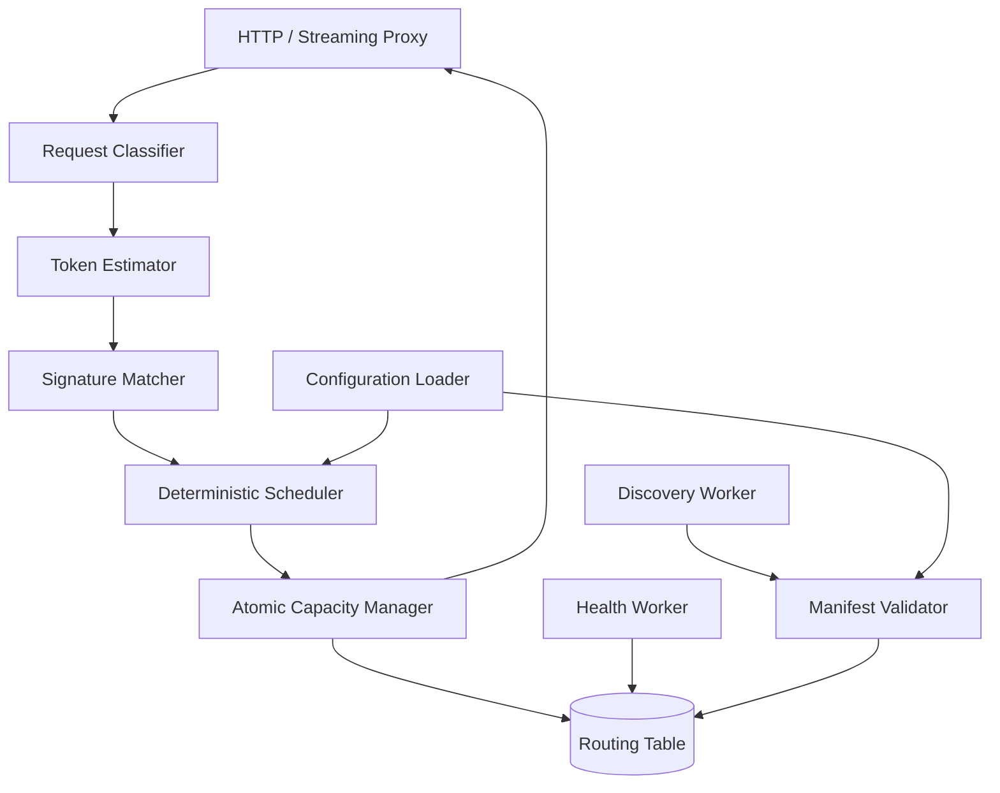
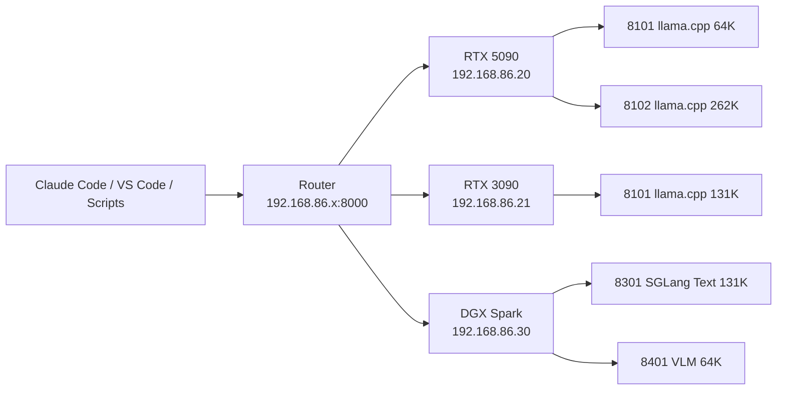
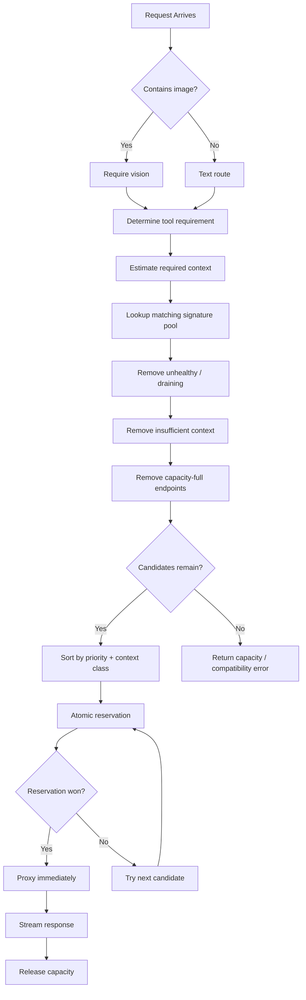
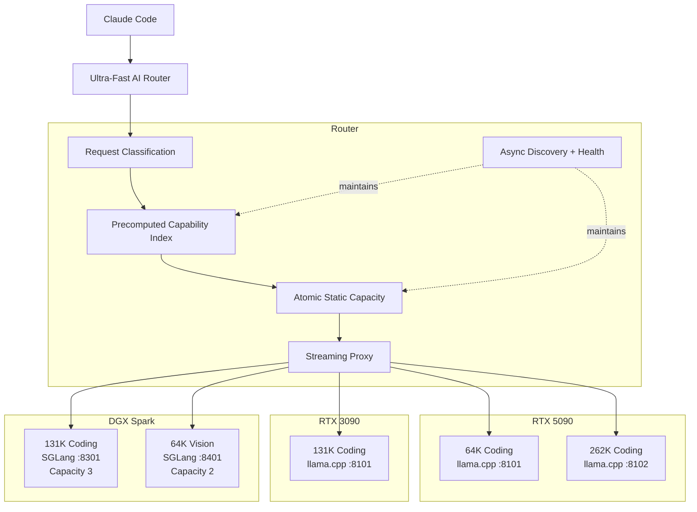

# EXECUTION HANDOFF — Build and Deploy the Local LLM Router

## Mission

You are the implementation agent. Take this design from documentation to a working deployment.

The user currently has Claude Code connected **directly** to the RTX 5090 as a temporary bypass. Do not disturb that working path until the router is fully built, deployed, tested, and proven.

Your job is to:

1. Inspect the current environment and existing deployments.
2. Build the actual custom router implementation described below.
3. Build a Docker image for it locally; do **not** assume a public image exists.
4. Deploy the router on the machine the user calls **Databrick**.
5. Integrate the already-running RTX 5090 vLLM endpoint.
6. Prepare the architecture for the RTX 3090 and DGX Spark endpoints without inventing unknown host/IP/runtime facts.
7. Validate routing, streaming, tool use, context handling, endpoint health, static capacity, deterministic priority, and failure behavior.
8. Keep the direct-5090 Claude Code bypass working until the new router has passed all acceptance tests.
9. Produce a concise final deployment report containing exact endpoints, ports, container names, image tags, health state, and rollback procedure.

This is an implementation task. Do not merely explain what should be done. Inspect, edit, build, deploy, test, and verify.

---

# 1. Known Facts — Treat These as Authoritative

## RTX 5090 host

- Host role/name: `rtx5090` / RedPCv2
- LAN IPv4: `192.168.86.37`
- LAN subnet: `/24`
- Gateway: `192.168.86.1`
- Tailscale address also exists, but for normal LAN routing prefer `192.168.86.37`.
- GPU: NVIDIA GeForce RTX 5090
- Runtime: vLLM `0.27.1`
- Model repository: `joshebbs/qwen3.8-27b-uncensored-nvfp4-modelopt`
- Local model path: `/models/Qwen3.8-27B-Uncensored-NVFP4`
- Served model name: `qwen3.8`
- Model family/canonical model: `Qwen3.8-27B-Uncensored`
- Quantization: ModelOpt NVFP4
- KV cache: FP8
- Max model context: `262144`
- Actual vLLM executable argument: `--max-num-seqs 1`
- Actual observed full-context concurrency: approximately `1.02x`
- Therefore router static capacity for the full 262K endpoint is **1**
- Thinking: hard OFF
- Tools: ON
- Streaming: ON
- Vision: OFF
- Tool-call parser: `qwen3_coder`
- Reasoning parser: `qwen3`
- Chat template policy: local patched Qwen3.8 template with thinking disabled
- Internal vLLM listener remains `8006`
- Go-forward host-facing vLLM published port: **8201**
- Intended direct LAN URL: `http://192.168.86.37:8201`
- Health: `/health`
- Models: `/v1/models`
- Metrics: `/metrics`
- OpenAI chat: `/v1/chat/completions`
- OpenAI Responses: `/v1/responses`
- Anthropic-compatible vLLM endpoint: `/v1/messages`

IMPORTANT: verify the active Docker port mapping before depending on it. The desired deployment mapping is:

```text
HOST 8201 -> CONTAINER 8006
```

Do not change the internal vLLM listener from 8006 merely to satisfy the port contract. The permanent contract applies to the **host-facing published port**.

## Current state

Claude Code is presently using a temporary direct-5090 bypass. This is the safety/rollback path. Preserve it during implementation.

The 5090 runtime is already running and healthy. Do not change its model, quantization, context, KV configuration, tool parser, thinking behavior, or other inference behavior as part of the router project.

---

# 2. Unknown Facts — Discover, Do Not Invent

The machine called **Databrick** is intended to host the router. Its current LAN IP, Docker/Portainer details, exact operating system, existing stack names, and current router-related containers must be inspected.

Likewise, do not invent the 3090 or DGX Spark addresses, ports, capacities, model signatures, or runtimes. Inspect their current deployments when access is available.

If you can access Databrick through SSH, Portainer, Docker context, an existing management API, or another already-configured mechanism, use it. Prefer non-destructive inspection first.

Do not make a guessed networking change merely because an old script contains a stale or unusual address.

---

# 3. Permanent Port Contract

These ranges are infrastructure policy:

| Function | Host-facing range |
|---|---:|
| Router APIs | `8000-8009` |
| llama.cpp | `8100-8199` |
| vLLM | `8200-8299` |
| SGLang | `8300-8399` |
| Dedicated VLM endpoints | `8400-8499` |
| Embeddings / rerankers | `8500-8599` |
| Metrics / exporters | `9000-9099` |
| Management / admin | `9100-9199` |

Rules:

- Router should normally bind `8000`.
- Existing 5090 vLLM is assigned `8201`.
- A runtime/port-range mismatch is a configuration error and must exclude the endpoint.
- Container-internal ports do not have to match the contract; published host ports do.
- New model endpoints on the same host get unique host-facing ports from the correct range.

---

# 4. Core Architecture Contract

The router is intentionally split into a **control plane** and a **hot data plane**.

## Control plane

Runs asynchronously and may:

- discover endpoints
- poll endpoint health
- validate manifests and signatures
- maintain endpoint state
- update in-memory routing indexes
- manage drain/undrain state
- repair leaked capacity leases
- expose admin/status information
- scrape or expose metrics

The control plane must never add a synchronous dependency to the request hot path.

## Hot data plane

For every inference request, the normal hot path must be approximately:

```text
receive request
  -> classify required capabilities
  -> determine/estimate required context
  -> read in-memory candidate set
  -> filter by compatibility/signature/context/health/enabled/draining
  -> atomically reserve static capacity
  -> connect to chosen upstream
  -> stream bytes
  -> release reservation only when stream/request actually terminates
```

The hot path MUST NOT perform:

- per-request GPU utilization query
- `nvidia-smi`
- Prometheus query
- Portainer query
- Docker query
- runtime queue query
- synchronous endpoint health check
- database query
- dynamic capacity inference

Core principle:

> DISCOVER SLOWLY / VALIDATE STRICTLY / STORE LOCALLY / ROUTE IMMEDIATELY / COUNT ATOMICALLY / STREAM DIRECTLY

---

# 5. Static Capacity Is a Contract

Capacity is configured per endpoint.

Do not infer capacity from current GPU percentage, VRAM utilization, vLLM scheduler state, queue depth, or other runtime telemetry.

For the 5090 262K endpoint:

```yaml
static_capacity: 1
```

Maintain an atomic in-flight counter per endpoint.

Reservation must be a single atomic operation. Do not use:

```text
if inflight < capacity:
    inflight++
```

unless the compare-and-increment is actually atomic.

If a reservation race is lost, immediately try the next compatible endpoint.

Release the slot on:

- normal non-stream completion
- normal stream completion
- client disconnect
- upstream disconnect/error
- canceled request
- timeout

Do **not** release on receipt of response headers.

Use a capacity lease/watchdog to recover leaked counters after abnormal process/network failure. Lease repair is asynchronous control-plane work.

Suggested hard lease ceiling:

```text
7200 seconds
```

unless implementation/testing supports a better configurable value.

---

# 6. Endpoint Health State

Maintain endpoint health asynchronously.

State model:

```text
UNKNOWN
HEALTHY
SUSPECT
UNHEALTHY
```

Suggested defaults:

```text
health interval:       2000 ms
health timeout:         750 ms
failure threshold:        2
recovery threshold:       2
```

A failed health probe must not immediately flap an endpoint in and out of service unless the threshold says so.

The request path only reads the already-computed in-memory health state.

---

# 7. Endpoint Manifest and Signature Enforcement

Each endpoint has a declarative identity.

Preferred network convention when practical:

```text
GET /.well-known/llm-router-manifest
```

Alternative:

```text
GET /router/manifest
```

The current 5090 Compose also contains deployment metadata via `x-router-manifest` and `ai.router.*` Docker labels. Those are descriptors; they are not a router.

The router may support one or more discovery mechanisms:

1. Explicit static seed configuration — required.
2. Docker/Portainer metadata discovery — useful when available.
3. Network manifest endpoint — preferred for runtime-independent discovery.

Do not add a reverse proxy/sidecar to every runtime solely to create a manifest endpoint unless it is actually necessary. Metadata discovery is control-plane work.

## Hard signature dimensions

Reject incompatible endpoints. Hard signature fields include, as applicable:

- API family
- canonical model/model family
- tokenizer identity
- chat template identity/policy
- tool schema
- tool-call support/parser
- streaming support
- vision support and image schema
- max context
- max output
- thinking/reasoning behavior

## Soft attributes

May influence ranking but should not automatically make endpoints incompatible:

- runtime implementation
- runtime version
- quantization
- GPU class
- measured speed
- affinity/cache hints

The 5090 signature group is:

```text
qwen38-coding-thinking-off
```

---

# 8. Context-Aware Routing

The router must inspect or estimate the actual request size.

Do not assume Claude Code explicitly negotiates “64K vs 131K vs 262K”.

Use context classes:

```text
64K   = 65536
131K  = 131072
262K  = 262144
```

Calculate required context approximately as:

```text
estimated_input_tokens
+ requested_or_default_max_output
+ reserve
```

Reserve rule:

```text
max(4096 tokens, 5% of request)
```

Then choose the **smallest compatible context pool** that safely satisfies the request.

If only a 262K endpoint currently exists, it naturally receives requests that fit it.

Never send a request to an endpoint whose context limit is too small.

---

# 9. Capability Routing

Capability filtering happens before host preference.

Text-only requests:

- may use compatible text endpoints.

Image/multimodal requests:

- may only use endpoints explicitly marked vision/VLM capable.

The current 5090 endpoint is **vision=false** even though underlying model-related code may include multimodal processor classes. It was started with language-model-only/text-only behavior. Do not advertise it as a VLM.

Tool requests:

- require tools capability and compatible tool schema/parser.

Streaming requests:

- require streaming capability.

---

# 10. Deterministic Priority

Normal host preference is intended to be:

```text
RTX 5090
  -> RTX 3090
  -> DGX Spark
```

But compatibility and context filtering happen first.

Suggested priority values:

```text
5090      priority 10
3090      priority 20
DGX Spark priority 30
```

Use lower numeric value as higher preference.

Do not configure 3090/Spark until their actual runtime/model/capacity/context facts are verified.

Within equally valid candidates, keep ordering deterministic.

Optional preferred conversation affinity may be used for prefix-cache reuse, but it is only a preference. It must never block fallback when the preferred endpoint is full/unhealthy/incompatible.

---

# 11. Streaming and Failover Semantics

Streaming must be direct and low-overhead.

Before meaningful response output starts:

- if connection/setup to an upstream fails, release the reservation and try the next compatible endpoint.

After meaningful response bytes/tokens have begun:

- never silently migrate the generation to another backend.

That would create a semantically invalid mixed response.

Preserve client disconnect/cancellation through to the upstream when possible.

---

# 12. API Compatibility

The router should expose at least:

```text
GET  /health
GET  /metrics
GET  /v1/models
POST /v1/chat/completions
POST /v1/responses
```

Because the current local workflow uses Claude Code through Anthropic-compatible vLLM behavior, the router should also proxy:

```text
POST /v1/messages
```

and, if required by Claude Code:

```text
POST /v1/messages/count_tokens
```

Do not transform request/response semantics unnecessarily. Prefer transparent proxying once an endpoint has been selected.

Expose a stable public model alias such as:

```text
local-coding
```

The router should hide the physical topology from clients.

If needed, translate `local-coding` to the compatible backend served-model name (`qwen3.8`) before forwarding, and translate model identity in responses only when required for client compatibility.

---

# 13. Administrative API

Implement or preserve these useful endpoints:

```text
GET  /admin/hosts
GET  /admin/endpoints
GET  /admin/routing-table
GET  /admin/requests
GET  /admin/config

POST /admin/discovery/rescan

POST /admin/endpoints/{id}/enable
POST /admin/endpoints/{id}/disable
POST /admin/endpoints/{id}/drain
POST /admin/endpoints/{id}/undrain
```

Optional:

```text
POST /admin/config/reload
```

Graceful drain means:

```text
stop new reservations
allow inflight requests to finish
then endpoint may be disabled/restarted
```

---

# 14. Observability

Expose Prometheus metrics without consulting Prometheus from the request path.

Useful router metrics:

```text
router_requests_total
router_requests_inflight
router_request_duration_seconds
router_route_selection_total
router_upstream_connect_duration_seconds

router_endpoint_capacity
router_endpoint_inflight
router_endpoint_available
router_endpoint_healthy
router_endpoint_registered

router_rejections_total
router_upstream_errors_total
router_client_disconnects_total
```

Label carefully to avoid unbounded cardinality.

Log routing decisions with enough information to diagnose:

- request ID
- selected pool
- required capabilities
- estimated context requirement
- chosen endpoint
- reason candidates were rejected
- reservation outcome
- failover-before-stream outcome
- final release reason

Do not log complete prompts by default.

---

# 15. Standard Rejection / Diagnostic Codes

Use stable internal/admin diagnostic codes such as:

```text
PORT_CONTRACT_MISMATCH
MANIFEST_INVALID
MODEL_SIGNATURE_MISMATCH
VISION_REQUIRED
TOOLS_REQUIRED
STREAMING_REQUIRED
CONTEXT_TOO_SMALL
OUTPUT_LIMIT_TOO_SMALL
ENDPOINT_UNHEALTHY
ENDPOINT_DISABLED
ENDPOINT_DRAINING
CAPACITY_FULL
RESERVATION_RACE_LOST
UPSTREAM_CONNECT_FAILED
```

Map them to appropriate client-facing HTTP behavior without leaking irrelevant infrastructure details.

---

# 16. Implementation Technology

Preferred implementation: **Go**.

Reasons:

- small single binary
- low-overhead HTTP streaming
- mature networking
- straightforward atomics/synchronization
- easy Prometheus support
- easy container packaging

Suggested repository:

```text
llm-router/
├── cmd/
│   └── router/
│       └── main.go
├── internal/
│   ├── api/
│   ├── capacity/
│   ├── config/
│   ├── discovery/
│   ├── health/
│   ├── manifest/
│   ├── proxy/
│   ├── registry/
│   ├── routing/
│   └── telemetry/
├── config/
│   └── router.yaml
├── tests/
├── Dockerfile
├── docker-compose.yml
├── go.mod
├── go.sum
└── README.md
```

Do not over-engineer this into microservices.

One router process with internal control-plane goroutines and a direct HTTP proxy data plane is preferred.

No database is needed for the single-router deployment.

If active-active routers are added later, shared coordination can be reconsidered. Do not add Redis now merely because it might be useful later.

---

# 17. Router Image

There is no existing public image.

This placeholder from earlier configuration:

```text
local/llm-router:1.0.0
```

means:

1. write the Go source
2. build the binary
3. build a Docker image
4. tag it locally
5. deploy that image on Databrick

Example:

```bash
docker build -t local/llm-router:1.0.0 .
```

If Databrick cannot see an image built on another machine, either:

- build the image directly on Databrick, or
- use the user's existing private registry if one is already configured, or
- transfer/load the image through a normal Docker-supported workflow.

Do not invent or introduce a registry unless needed.

---

# 18. Deployment Workflow — Execute in This Order

## Phase A — Inspect and preserve rollback

1. Confirm the direct-5090 path still works.
2. Record current Docker containers/stacks on:
   - 5090
   - Databrick
   - other accessible GPU hosts
3. Determine the actual Databrick LAN address.
4. Determine how Portainer manages Databrick:
   - local Docker endpoint
   - Portainer Agent
   - direct Docker socket
   - other existing arrangement
5. Back up any router-related current stack/config before changing it.
6. Do not stop the 5090 model.

## Phase B — Verify the 5090 runtime contract

Confirm from the 5090 host:

```text
http://127.0.0.1:8201/health
http://127.0.0.1:8201/v1/models
```

and, from Databrick:

```text
http://192.168.86.37:8201/health
http://192.168.86.37:8201/v1/models
```

If localhost works but LAN does not:

- inspect Docker port publication
- inspect Windows firewall
- inspect Docker Desktop/WSL networking
- fix reachability narrowly
- do not change vLLM inference configuration

Expected model ID:

```text
qwen3.8
```

Expected host mapping:

```text
0.0.0.0:8201 -> container:8006
```

## Phase C — Implement router

Implement:

- config parsing
- endpoint registry
- strict manifest validation
- port-contract validation
- endpoint signature validation
- asynchronous health worker
- in-memory indexes
- deterministic routing
- context requirement classification
- capability filtering
- atomic capacity reservation
- capacity lease cleanup
- direct streaming reverse proxy
- pre-stream failover
- client cancellation propagation
- `/v1/models`
- `/v1/chat/completions`
- `/v1/responses`
- `/v1/messages`
- `/v1/messages/count_tokens` if Claude Code requires it
- `/health`
- `/metrics`
- admin APIs
- structured routing logs

Do not dynamically ask vLLM “how busy are you?” before routing.

## Phase D — Seed only the confirmed 5090 endpoint initially

Use this endpoint:

```yaml
id: rtx5090-qwen38-262k-01
enabled: true

host:
  name: rtx5090
  address: 192.168.86.37
  gpu_class: RTX_5090

runtime:
  type: vllm
  version: 0.27.1
  api_family: openai
  port: 8201

model:
  canonical_name: Qwen3.8-27B-Uncensored
  served_model_name: qwen3.8
  quantization: modelopt_fp4

capabilities:
  text: true
  vision: false
  tools: true
  streaming: true
  reasoning: true

context:
  max_context_tokens: 262144
  context_class: 262k

behavior:
  thinking: false
  tool_schema: openai
  tool_call_parser: qwen3_coder
  reasoning_parser: qwen3
  chat_template_policy: local-patched-qwen3.8-thinking-off

routing:
  pool: coding
  static_capacity: 1
  priority: 10
  signature_group: qwen38-coding-thinking-off

health:
  path: /health

models:
  path: /v1/models

metrics:
  path: /metrics
```

## Phase E — Build and deploy on Databrick

Build/tag:

```text
local/llm-router:1.0.0
```

Deploy router on:

```text
host port 8000
```

The router container must be able to reach:

```text
192.168.86.37:8201
```

Do not use `localhost:8201` from a router container running on Databrick because that would refer to Databrick itself.

## Phase F — Validate with one backend

Run these tests before touching Claude Code:

### Health

```text
GET http://<DATABRICK_IP>:8000/health
```

Must return healthy router state.

### Models

```text
GET http://<DATABRICK_IP>:8000/v1/models
```

Must advertise the stable client alias and/or a compatible model identity.

### OpenAI non-stream request

Send a tiny deterministic prompt through:

```text
POST /v1/chat/completions
```

Confirm it reaches the 5090.

### Streaming

Send:

```json
"stream": true
```

Confirm incremental chunks reach the client immediately.

### Anthropic-compatible Claude Code path

Test:

```text
POST /v1/messages
```

with the model alias expected by the router.

If Claude Code uses token counting, test:

```text
POST /v1/messages/count_tokens
```

### Tools

Send a simple tool definition and confirm the model/router path preserves the Qwen tool call structure expected by Claude Code.

### Thinking off

Confirm no unwanted thinking/reasoning mode is enabled by router translation.

### Capacity

With 5090 static capacity = 1:

1. hold one long request open
2. send a second compatible request
3. verify the router does not send the second request concurrently to that same endpoint beyond configured capacity
4. if no alternate endpoint exists yet, return a controlled capacity response rather than creating fake availability

### Release

Confirm capacity returns to 1 available after:

- normal completion
- client cancellation/disconnect
- upstream error

### Health removal

Temporarily mark/stop the endpoint only if safe, or use a controlled test endpoint, and verify asynchronous health state removes it from candidates without adding health work to the request path.

Restore immediately.

## Phase G — Add 3090 and DGX Spark only after inspection

For each host:

1. determine actual LAN IP
2. determine runtime
3. determine actual host-facing published port
4. force that published port into the permanent runtime range
5. determine model identity
6. determine actual max context
7. determine tools/streaming/vision support
8. determine actual executable concurrency/capacity
9. set static capacity from tested/authoritative runtime behavior
10. create signature
11. assign priority
12. validate
13. add to router registry

Do not copy the 5090 manifest and merely change the hostname.

---

# 19. Acceptance Criteria

Do not call the router complete until all applicable items pass.

## Deployment

- router image built successfully
- router container remains healthy
- router restarts automatically
- Portainer reflects the deployed stack
- configuration survives restart

## 5090 integration

- Databrick reaches `192.168.86.37:8201`
- `/health` succeeds
- `/v1/models` sees `qwen3.8`
- router knows context = 262144
- router knows static capacity = 1
- router knows vision=false
- router knows tools=true
- router knows thinking=false

## Data plane

- non-streaming works
- streaming works
- client disconnect does not leak capacity
- upstream error does not leak capacity
- no synchronous health/GPU/Portainer/Prometheus query occurs in request handling
- reservation is atomic
- failover is only before stream output begins

## Claude Code

- direct bypass remains available during testing
- Claude Code can connect to router
- Claude Code sees expected model
- long context does not get artificially clamped by router
- tools work
- thinking remains off
- streaming is stable

## Operations

- `/metrics` exposes router metrics
- `/admin/endpoints` shows endpoint state
- `/admin/routing-table` shows deterministic candidate order
- drain/undrain works
- restart does not leave phantom inflight slots

---

# 20. Rollback

At every stage maintain the ability to return to:

```text
Claude Code
  -> direct RTX 5090
  -> 192.168.86.37:<working published vLLM port>
```

If router deployment fails:

1. stop/disable only the new router stack
2. leave 5090 runtime untouched
3. restore any previous Databrick router stack only if it was changed
4. continue using the temporary direct-5090 launcher

Never make router success a prerequisite for keeping the already-working model online.

---

# 21. Final Report Required From You

After implementation, report exactly:

```text
Databrick LAN IP:
Router container:
Router image:
Router public URL:
Router health:
Router version/commit:

Registered endpoints:
  ID:
  host/IP:
  runtime:
  host-facing port:
  internal port if known:
  model:
  context:
  capacity:
  priority:
  health:
  signature group:

Tests:
  /health:
  /v1/models:
  /v1/chat/completions:
  streaming:
  /v1/messages:
  count_tokens:
  tools:
  thinking-off:
  capacity:
  disconnect release:
  restart persistence:

Files changed:
Backups created:
Rollback command/procedure:
Known remaining issues:
```

Do not finish with vague statements such as “it should work.” Show the actual test results.

---

# 22. Important Non-Goals / Do-Not-Change Rules

Do not:

- change the 5090 model
- change the 5090 quantization
- change 262K context
- enable vision on the 5090 endpoint
- enable thinking
- change tool parser unless required and explicitly justified
- dynamically infer router capacity from GPU utilization
- perform health checks in the request hot path
- add Redis for a single router
- add a database to the hot path
- silently reroute after output streaming has started
- invent 3090/Spark host facts
- destroy the direct bypass before router acceptance testing
- pull a random third-party router image and call the architecture complete
- expose the Docker socket to the router data plane unless a specific control-plane discovery mechanism genuinely requires it and the security tradeoff is accepted
- replace deterministic priority with random or least-utilized routing

---

# 23. Current Reference Router Stack

The following is the existing deployment YAML drafted for the router. Treat it as a reference contract, not as proof that the router image exists. Adapt it to the actual implemented configuration interface if necessary, while preserving behavior.

```yaml
version: "3.9"

services:
  llm-router:
    # This is the custom Go router defined by the go-forward architecture.
    # Build/tag the router implementation as this image before deployment.
    image: local/llm-router:1.0.0
    container_name: llm-router
    hostname: llm-router
    restart: unless-stopped
    init: true
    stop_grace_period: 30s

    ports:
      # Permanent router/API range: 8000-8009
      - "8000:8000"

    environment:
      # ----------------------------------------------------------------------
      # LISTENER / PUBLIC API
      # ----------------------------------------------------------------------
      ROUTER_LISTEN_ADDR: "0.0.0.0:8000"
      ROUTER_PUBLIC_MODEL_ALIAS: "local-coding"

      # OpenAI-compatible endpoints exposed by the router:
      #   POST /v1/chat/completions
      #   POST /v1/responses
      #   GET  /v1/models
      #
      # Anthropic compatibility, when enabled by the router implementation:
      #   POST /v1/messages
      ROUTER_ENABLE_OPENAI_API: "true"
      ROUTER_ENABLE_ANTHROPIC_API: "true"

      # ----------------------------------------------------------------------
      # HOT-PATH RULES
      # ----------------------------------------------------------------------
      # These are intentionally static. The request path must NOT query GPU,
      # Prometheus, Docker, Portainer, vLLM queues, or health endpoints.
      ROUTER_DYNAMIC_GPU_CAPACITY: "false"
      ROUTER_REQUEST_PATH_HEALTH_CHECKS: "false"
      ROUTER_DETERMINISTIC_ROUTING: "true"

      # Atomic capacity reservation is required.
      ROUTER_ATOMIC_RESERVATIONS: "true"

      # Release capacity only when the request/stream actually terminates.
      ROUTER_RELEASE_ON_STREAM_END: "true"

      # ----------------------------------------------------------------------
      # CONTEXT ROUTING
      # ----------------------------------------------------------------------
      ROUTER_CONTEXT_RESERVE_TOKENS: "4096"
      ROUTER_CONTEXT_RESERVE_PERCENT: "5"

      # Prefer the smallest context class that can safely satisfy a request.
      ROUTER_CONTEXT_CLASSES: "65536,131072,262144"
      ROUTER_PREFER_SMALLEST_SUFFICIENT_CONTEXT: "true"

      # ----------------------------------------------------------------------
      # FAILURE / RETRY
      # ----------------------------------------------------------------------
      # Failover is permitted only before meaningful upstream output begins.
      ROUTER_RETRY_BEFORE_STREAM_START: "true"
      ROUTER_RETRY_AFTER_STREAM_START: "false"

      ROUTER_UPSTREAM_CONNECT_TIMEOUT_MS: "250"
      ROUTER_UPSTREAM_RESPONSE_HEADER_TIMEOUT_MS: "750"

      # Lease watchdog is control-plane only and never queried in the hot path.
      ROUTER_CAPACITY_LEASE_HARD_TIMEOUT_SEC: "7200"

      # ----------------------------------------------------------------------
      # ASYNC CONTROL PLANE
      # ----------------------------------------------------------------------
      ROUTER_DISCOVERY_ENABLED: "true"
      ROUTER_DISCOVERY_INTERVAL_MS: "5000"

      ROUTER_HEALTH_ENABLED: "true"
      ROUTER_HEALTH_INTERVAL_MS: "2000"
      ROUTER_HEALTH_TIMEOUT_MS: "750"
      ROUTER_HEALTH_FAILURE_THRESHOLD: "2"
      ROUTER_HEALTH_RECOVERY_THRESHOLD: "2"

      # ----------------------------------------------------------------------
      # PERMANENT PORT CONTRACT
      # ----------------------------------------------------------------------
      ROUTER_PORT_RANGE_ROUTER: "8000-8009"
      ROUTER_PORT_RANGE_LLAMACPP: "8100-8199"
      ROUTER_PORT_RANGE_VLLM: "8200-8299"
      ROUTER_PORT_RANGE_SGLANG: "8300-8399"
      ROUTER_PORT_RANGE_VLM: "8400-8499"
      ROUTER_PORT_RANGE_EMBEDDINGS: "8500-8599"
      ROUTER_PORT_RANGE_METRICS: "9000-9099"
      ROUTER_PORT_RANGE_MANAGEMENT: "9100-9199"

      ROUTER_ENFORCE_PORT_CONTRACT: "true"
      ROUTER_ENFORCE_SIGNATURES: "true"

      # ----------------------------------------------------------------------
      # HOST DISCOVERY
      # ----------------------------------------------------------------------
      # 5090 LAN address supplied by the host:
      #   192.168.86.37/24
      #
      # The router probes only the reserved inference ranges during asynchronous
      # discovery. Additional hosts can be appended later without changing code.
      ROUTER_DISCOVERY_HOSTS: "192.168.86.37"

      # ----------------------------------------------------------------------
      # INITIAL REGISTERED ENDPOINT: RTX 5090
      # ----------------------------------------------------------------------
      # The first endpoint is explicitly seeded so the router can use it
      # immediately while discovery runs in the background.
      ROUTER_ENDPOINTS_JSON: >-
        [
          {
            "id": "rtx5090-qwen38-262k-01",
            "enabled": true,
            "host": {
              "name": "rtx5090",
              "address": "192.168.86.37",
              "gpu_class": "RTX_5090",
              "priority": 10
            },
            "runtime": {
              "type": "vllm",
              "version": "0.27.1",
              "api_family": "openai",
              "port": 8201
            },
            "model": {
              "canonical_name": "Qwen3.8-27B-Uncensored",
              "served_model_name": "qwen3.8",
              "quantization": "modelopt_fp4"
            },
            "capabilities": {
              "text": true,
              "vision": false,
              "tools": true,
              "streaming": true,
              "reasoning": true
            },
            "context": {
              "max_context_tokens": 262144,
              "context_class": "262k"
            },
            "behavior": {
              "thinking": false,
              "tool_schema": "openai",
              "tool_call_parser": "qwen3_coder",
              "reasoning_parser": "qwen3",
              "chat_template_policy": "local-patched-qwen3.8-thinking-off"
            },
            "routing": {
              "pool": "coding",
              "static_capacity": 1,
              "priority": 10,
              "signature_group": "qwen38-coding-thinking-off"
            },
            "health": {
              "path": "/health"
            },
            "models": {
              "path": "/v1/models"
            },
            "metrics": {
              "path": "/metrics"
            }
          }
        ]

      # ----------------------------------------------------------------------
      # OBSERVABILITY / ADMIN
      # ----------------------------------------------------------------------
      ROUTER_METRICS_ENABLED: "true"
      ROUTER_METRICS_PATH: "/metrics"
      ROUTER_HEALTH_PATH: "/health"

      ROUTER_ADMIN_ENABLED: "true"
      ROUTER_ADMIN_PREFIX: "/admin"

      # Keep logs useful without adding expensive hot-path introspection.
      ROUTER_LOG_LEVEL: "info"
      ROUTER_LOG_ROUTING_DECISIONS: "true"

      # Optional preferred conversation affinity. It is not a hard dependency:
      # if the preferred endpoint is unavailable/full, normal routing continues.
      ROUTER_AFFINITY_MODE: "preferred"
      ROUTER_AFFINITY_FALLBACK: "true"

    logging:
      driver: json-file
      options:
        max-size: "100m"
        max-file: "5"

    healthcheck:
      test:
        - CMD-SHELL
        - >-
          wget -qO- http://127.0.0.1:8000/health >/dev/null 2>&1 || exit 1
      interval: 10s
      timeout: 3s
      retries: 6
      start_period: 10s

    labels:
      ai.router.role: "router"
      ai.router.schema-version: "1.0"
      ai.router.public-port: "8000"
      ai.router.public-model: "local-coding"
      ai.router.port-contract: "enforced"
      ai.router.discovery: "async"
      ai.router.capacity-mode: "static-atomic"
      ai.router.hot-path-health-checks: "false"
      ai.router.dynamic-gpu-capacity: "false"
```

---

# 24. Current Reference RTX 5090 Runtime Stack

This is the router-compliant 5090 runtime YAML. Preserve its inference behavior. If the live deployment differs, inspect and reconcile carefully rather than blindly redeploying.

```yaml
x-router-manifest:
  schema_version: "1.0"

  instance:
    id: "rtx5090-qwen38-262k-01"
    display_name: "RTX 5090 Qwen3.8-27B Uncensored NVFP4 262K"
    enabled: true

  host:
    name: "rtx5090"
    gpu_class: "RTX_5090"
    gpu_count: 1

  runtime:
    type: "vllm"
    version: "0.27.1"
    api_family: "openai"
    published_port: 8201
    container_port: 8006

  model:
    canonical_name: "Qwen3.8-27B-Uncensored"
    served_model_name: "qwen3.8"
    repository: "joshebbs/qwen3.8-27b-uncensored-nvfp4-modelopt"
    quantization: "modelopt_fp4"

  capabilities:
    text: true
    vision: false
    tools: true
    streaming: true
    reasoning: true

  context:
    max_context_tokens: 262144

  request_format:
    tool_schema: "openai"
    tool_call_parser: "qwen3_coder"
    reasoning_parser: "qwen3"
    chat_template_policy: "local-patched-qwen3.8-thinking-off"

  behavior:
    thinking_mode: false

  routing:
    static_capacity: 1
    priority: 10
    pool: "coding"
    context_class: "262k"
    signature_group: "qwen38-coding-thinking-off"

  observability:
    health_path: "/health"
    models_path: "/v1/models"
    metrics_path: "/metrics"

services:
  qwen38-vllm-5090:
    image: vllm/vllm-openai:v0.27.1
    container_name: qwen38-vllm-5090
    hostname: qwen38-vllm-5090

    labels:
      ai.router.enabled: "true"
      ai.router.schema-version: "1.0"
      ai.router.instance-id: "rtx5090-qwen38-262k-01"
      ai.router.host: "rtx5090"
      ai.router.runtime: "vllm"
      ai.router.runtime-version: "0.27.1"
      ai.router.api-family: "openai"
      ai.router.published-port: "8201"
      ai.router.container-port: "8006"
      ai.router.model-family: "qwen3.8"
      ai.router.model: "Qwen3.8-27B-Uncensored"
      ai.router.served-model-name: "qwen3.8"
      ai.router.quantization: "modelopt_fp4"
      ai.router.context: "262144"
      ai.router.context-class: "262k"
      ai.router.text: "true"
      ai.router.vision: "false"
      ai.router.tools: "true"
      ai.router.streaming: "true"
      ai.router.thinking-mode: "false"
      ai.router.tool-schema: "openai"
      ai.router.tool-call-parser: "qwen3_coder"
      ai.router.reasoning-parser: "qwen3"
      ai.router.chat-template-policy: "local-patched-qwen3.8-thinking-off"
      ai.router.signature-group: "qwen38-coding-thinking-off"
      ai.router.pool: "coding"
      ai.router.capacity: "1"
      ai.router.priority: "10"
      ai.router.health-path: "/health"
      ai.router.models-path: "/v1/models"
      ai.router.metrics-path: "/metrics"

    restart: unless-stopped
    init: true
    ipc: host
    stop_grace_period: 2m

    # GO-FORWARD PORT CONTRACT:
    # vLLM host-facing ports are reserved to 8200-8299.
    # Keep the existing vLLM container listener on 8006 unchanged.
    ports:
      - "8201:8006"

    environment:
      NVIDIA_VISIBLE_DEVICES: "0"
      NVIDIA_DRIVER_CAPABILITIES: "compute,utility"
      CUDA_DEVICE_ORDER: "PCI_BUS_ID"

      MODEL_REPO: "joshebbs/qwen3.8-27b-uncensored-nvfp4-modelopt"
      MODEL_DIR: "/models/Qwen3.8-27B-Uncensored-NVFP4"

      HF_HOME: "/models/.cache/huggingface"
      HUGGINGFACE_HUB_CACHE: "/models/.cache/huggingface/hub"

      HF_TOKEN: "${HF_TOKEN:-}"

      DOWNLOAD_LIMIT_BPS: "26214400"

      PYTORCH_CUDA_ALLOC_CONF: "expandable_segments:True"

      VLLM_USE_FLASHINFER_SAMPLER: "1"

    volumes:
      - /home/darkmatter2222/models:/models

    deploy:
      resources:
        reservations:
          devices:
            - driver: nvidia
              count: 1
              capabilities:
                - gpu

    ulimits:
      memlock:
        soft: -1
        hard: -1

      stack:
        soft: 67108864
        hard: 67108864

    logging:
      driver: json-file
      options:
        max-size: "250m"
        max-file: "8"

    entrypoint:
      - /bin/bash
      - -lc

    command:
      - |
        set -Eeuo pipefail

        echo
        echo "======================================================================"
        echo " Qwen3.8-27B Uncensored NVFP4"
        echo " RTX 5090 - vLLM 0.27.1 - FULL 262K - FIXED 8.5 GiB KV"
        echo "======================================================================"
        echo " Repository   : $${MODEL_REPO}"
        echo " Model path   : $${MODEL_DIR}"
        echo " API          : http://0.0.0.0:8006/v1"
        echo " Anthropic    : http://0.0.0.0:8006/v1/messages"
        echo " Model alias  : qwen3.8"
        echo " Context      : 262144"
        echo " Parallel     : 2"
        echo " Weights      : NVFP4"
        echo " KV           : FP8"
        echo " KV allocation: fixed 8.5 GiB"
        echo " Spec decode  : OFF (MTP checkpoint incompatible)"
        echo "======================================================================"
        echo

        mkdir -p "$${MODEL_DIR}"
        mkdir -p "$${HF_HOME}"

        ######################################################################
        # RATE-LIMITED / RESUMABLE MODEL DOWNLOAD
        #
        # Aggregate bandwidth cap:
        # <= 25 MiB/sec
        ######################################################################

        python3 - <<'PY'
        import os
        import time
        from pathlib import Path
        from urllib.parse import quote

        import requests
        from huggingface_hub import HfApi

        repo = os.environ["MODEL_REPO"]
        root = Path(os.environ["MODEL_DIR"])

        token = os.environ.get("HF_TOKEN") or None

        rate = int(
            os.environ.get(
                "DOWNLOAD_LIMIT_BPS",
                "26214400",
            )
        )

        root.mkdir(
            parents=True,
            exist_ok=True,
        )

        api = HfApi(
            token=token,
        )

        print(
            f"Inspecting Hugging Face repository: {repo}",
            flush=True,
        )

        info = api.model_info(
            repo_id=repo,
            files_metadata=True,
        )

        files = list(
            info.siblings or []
        )

        print(
            f"Repository contains {len(files)} files.",
            flush=True,
        )

        print(
            f"Download limit: "
            f"{rate / 1024 / 1024:.1f} MiB/s",
            flush=True,
        )

        auth_headers = {}

        if token:
            auth_headers["Authorization"] = (
                f"Bearer {token}"
            )

        for item in files:

            rel = item.rfilename

            expected = getattr(
                item,
                "size",
                None,
            )

            dst = root / rel

            part = Path(
                str(dst) + ".part"
            )

            dst.parent.mkdir(
                parents=True,
                exist_ok=True,
            )

            ##################################################################
            # IMPORTANT
            #
            # chat_template.jinja is intentionally modified locally for
            # Claude/Anthropic compatibility.
            #
            # Its local size therefore differs from the HF original.
            # Preserve the local patched version on restart.
            ##################################################################

            if (
                rel == "chat_template.jinja"
                and dst.exists()
            ):

                print(
                    "SKIP: chat_template.jinja "
                    "(local compatibility patch preserved)",
                    flush=True,
                )

                continue

            ##################################################################
            # EXISTING COMPLETE FILE
            ##################################################################

            if dst.exists():

                if (
                    expected is None
                    or dst.stat().st_size == expected
                ):

                    print(
                        f"SKIP: {rel}",
                        flush=True,
                    )

                    continue

                print(
                    f"Existing file size is wrong; "
                    f"replacing: {rel}",
                    flush=True,
                )

                dst.unlink()

            ##################################################################
            # RESUME OFFSET
            ##################################################################

            offset = (
                part.stat().st_size
                if part.exists()
                else 0
            )

            encoded = quote(
                rel,
                safe="/",
            )

            url = (
                f"https://huggingface.co/"
                f"{repo}/resolve/main/"
                f"{encoded}?download=true"
            )

            headers = dict(
                auth_headers
            )

            if offset > 0:

                headers["Range"] = (
                    f"bytes={offset}-"
                )

                print(
                    f"RESUME: {rel} at "
                    f"{offset / 1024 / 1024:.1f} MiB",
                    flush=True,
                )

            else:

                print(
                    f"GET: {rel}",
                    flush=True,
                )

            ##################################################################
            # DOWNLOAD
            ##################################################################

            response = requests.get(
                url,
                headers=headers,
                stream=True,
                allow_redirects=True,
                timeout=(30, 300),
            )

            ##################################################################
            # RANGE NOT HONORED
            ##################################################################

            if (
                offset > 0
                and response.status_code != 206
            ):

                print(
                    f"Server refused resume for {rel}; "
                    f"restarting file.",
                    flush=True,
                )

                response.close()

                if part.exists():
                    part.unlink()

                offset = 0

                response = requests.get(
                    url,
                    headers=auth_headers,
                    stream=True,
                    allow_redirects=True,
                    timeout=(30, 300),
                )

            response.raise_for_status()

            mode = (
                "ab"
                if offset
                else "wb"
            )

            downloaded = 0

            started = (
                time.monotonic()
            )

            with open(
                part,
                mode,
            ) as handle:

                for chunk in response.iter_content(
                    chunk_size=1024 * 1024
                ):

                    if not chunk:
                        continue

                    handle.write(
                        chunk
                    )

                    downloaded += len(
                        chunk
                    )

                    ##########################################################
                    # 25 MiB/S BANDWIDTH LIMIT
                    ##########################################################

                    target_elapsed = (
                        downloaded / rate
                    )

                    actual_elapsed = (
                        time.monotonic()
                        - started
                    )

                    if (
                        target_elapsed
                        > actual_elapsed
                    ):

                        time.sleep(
                            target_elapsed
                            - actual_elapsed
                        )

            response.close()

            ##################################################################
            # SIZE VALIDATION
            ##################################################################

            if expected is not None:

                actual_size = (
                    part.stat().st_size
                )

                if actual_size != expected:

                    raise RuntimeError(
                        f"Size mismatch for {rel}: "
                        f"{actual_size} != {expected}"
                    )

            ##################################################################
            # PROMOTE PARTIAL DOWNLOAD
            ##################################################################

            os.replace(
                part,
                dst,
            )

            print(
                f"DONE: {rel}",
                flush=True,
            )

        ######################################################################
        # FINAL VALIDATION
        ######################################################################

        required = [
            root / "config.json",
            root / "tokenizer_config.json",
            root / "chat_template.jinja",
        ]

        for path in required:

            if not path.exists():

                raise RuntimeError(
                    f"Required file missing: {path}"
                )

        tensors = list(
            root.rglob(
                "*.safetensors"
            )
        )

        if not tensors:

            raise RuntimeError(
                "No safetensors files found "
                "after download."
            )

        print()
        print(
            "============================================================"
        )
        print(
            " MODEL DOWNLOAD / VALIDATION COMPLETE"
        )
        print(
            "============================================================"
        )
        print(
            f"Safetensor files: {len(tensors)}"
        )
        print(
            f"Model directory : {root}"
        )
        print(
            "============================================================"
        )
        PY

        ######################################################################
        # CLAUDE / ANTHROPIC COMPATIBILITY + HARD THINKING OFF
        #
        # Qwen3.8 normally enables thinking by default. Claude-style clients
        # may also send reasoning_effort=high. We hard-force enable_thinking
        # to false in the model chat template and still normalize high->xhigh
        # for compatibility if a future request enables reasoning again.
        ######################################################################

        echo
        echo "Patching Qwen3.8 template: THINKING OFF + high -> xhigh compatibility"

        python3 - <<'PY'
        from pathlib import Path

        path = Path(
            "/models/Qwen3.8-27B-Uncensored-NVFP4/chat_template.jinja"
        )

        text = path.read_text()
        changed = False

        # Hard-disable thinking inside the Jinja template itself. This wins even
        # if the client sends reasoning-related fields.
        hard_off_marker = "{# LOCAL_FORCE_THINKING_OFF #}"
        if hard_off_marker not in text:
            needle = ""
            if needle not in text:
                raise RuntimeError(
                    "Could not locate chat-template insertion point for thinking-off patch"
                )
            replacement = (
                hard_off_marker
                + "\n"
                + "\n"
                + needle
            )
            text = text.replace(needle, replacement, 1)
            changed = True
            print("Patched: enable_thinking forced to false")
        else:
            print("Thinking-off patch already present")

        # Keep Claude/OpenAI 'high' effort compatible with Qwen's 'xhigh'.
        compat_marker = "{# LOCAL_HIGH_TO_XHIGH #}"
        if compat_marker not in text:
            needle = (
                ""
            )
            if needle in text:
                replacement = (
                    needle
                    + "\n"
                    + compat_marker
                    + "\n"
                    + "\n"
                    + "\n"
                )
                text = text.replace(needle, replacement, 1)
                changed = True
                print("Patched: reasoning_effort high -> xhigh")
            else:
                # Thinking is hard-off, so this is non-fatal. Keep startup robust
                # if a future upstream template changes the reasoning block.
                print("NOTE: reasoning_effort initializer not found; thinking is still forced OFF")
        else:
            print("high -> xhigh compatibility patch already present")

        if changed:
            path.write_text(text)
            print("Chat template updated")
        else:
            print("Chat template already fully patched")
        PY

        ######################################################################
        # EVERYTHING LOCAL AFTER CONTROLLED DOWNLOAD
        ######################################################################

        export HF_HUB_OFFLINE=1
        export TRANSFORMERS_OFFLINE=1

        ######################################################################
        # GPU STATUS
        ######################################################################

        echo
        echo "======================================================================"
        echo " GPU STATUS BEFORE vLLM"
        echo "======================================================================"
        echo

        nvidia-smi || true

        ######################################################################
        # CONFIGURATION SUMMARY
        ######################################################################

        echo
        echo "======================================================================"
        echo " STARTING vLLM"
        echo "======================================================================"
        echo
        echo " Base URL      : http://0.0.0.0:8006/v1"
        echo " OpenAI Chat   : http://0.0.0.0:8006/v1/chat/completions"
        echo " Anthropic     : http://0.0.0.0:8006/v1/messages"
        echo " Models        : http://0.0.0.0:8006/v1/models"
        echo " Health        : http://0.0.0.0:8006/health"
        echo " Metrics       : http://0.0.0.0:8006/metrics"
        echo
        echo " Model alias   : qwen3.8"
        echo " Context       : 262144"
        echo " Max sequences : 2"
        echo
        echo " Quantization  : ModelOpt NVFP4"
        echo " KV cache      : FP8"
        echo " KV allocation : fixed 8.5 GiB"
        echo
        echo " Batch tokens  : 8192"
        echo " Attention     : FLASHINFER"
        echo " Chunk prefill : ON"
        echo " Prefix cache  : ON"
        echo
        echo " Spec decode   : OFF"
        echo " Thinking      : HARD OFF"
        echo " Reasoning map : high -> xhigh"
        echo
        echo " Vision        : OFF"
        echo
        echo "======================================================================"
        echo

        ######################################################################
        # VLLM ARGUMENT ARRAY
        ######################################################################

        VLLM_ARGS=(
          "$${MODEL_DIR}"

          "--served-model-name"
          "qwen3.8"

          "--host"
          "0.0.0.0"

          "--port"
          "8006"

          "--language-model-only"

          "--max-model-len"
          "262144"

          "--max-num-seqs"
          "1"

          "--max-num-batched-tokens"
          "8192"

          "--kv-cache-dtype"
          "fp8"

          "--kv-cache-memory-bytes"
          "9126805504"

          "--quantization"
          "modelopt_fp4"

          "--attention-backend"
          "FLASHINFER"

          "--enable-chunked-prefill"

          "--async-scheduling"

          "--enable-prefix-caching"

          "--trust-remote-code"

          "--default-chat-template-kwargs"
          '{"enable_thinking":false}'

          "--reasoning-parser"
          "qwen3"

          "--enable-auto-tool-choice"

          "--tool-call-parser"
          "qwen3_coder"
        )

        ######################################################################
        # PRINT EXACT COMMAND
        ######################################################################

        echo "Executing:"
        echo

        printf ' %q' \
          vllm \
          serve \
          "$${VLLM_ARGS[@]}"

        echo
        echo

        ######################################################################
        # START vLLM
        ######################################################################

        exec vllm serve "$${VLLM_ARGS[@]}"

    healthcheck:
      test:
        - CMD-SHELL
        - >-
          python3 -c "import urllib.request;
          urllib.request.urlopen(
          'http://127.0.0.1:8006/health',
          timeout=5
          ).read()"

      interval: 30s
      timeout: 10s
      retries: 20
      start_period: 45m
```

---

# 25. Full Architecture Reference

The complete architecture/design document follows. Where this handoff is more explicit about known current facts (for example the confirmed 5090 LAN IP), use this handoff. Otherwise preserve the architecture principles below.

---

# Ultra-Fast Local LLM Router
## Architecture, Manifest, Routing Rules, Port Contracts, and Deployment Standard

**Status:** Proposed reference architecture  
**Primary clients:** Claude Code and OpenAI-compatible clients  
**Inference runtimes:** llama.cpp, vLLM, SGLang  
**Deployment platform:** Docker / Portainer  
**Primary design goals:** deterministic routing, millisecond-class router overhead, static capacity control, automatic endpoint discovery, strict compatibility enforcement, and easy expansion to additional GPU hosts.

---

# 1. Executive Summary

This architecture defines a lightweight local inference router that sits between clients such as Claude Code and a fleet of heterogeneous GPU inference servers.

The router must not perform slow health checks, model introspection, GPU polling, or capacity queries in the request hot path.

Instead, the system is divided into two planes:

1. **Control Plane**
   - Discovers candidate endpoints.
   - Performs health checks.
   - Reads or validates endpoint manifests.
   - Validates port contracts.
   - Builds endpoint capability signatures.
   - Enables or disables endpoints.
   - Maintains the in-memory routing table.

2. **Data Plane**
   - Receives OpenAI-compatible requests.
   - Determines request requirements.
   - Selects an already-approved endpoint from an in-memory routing table.
   - Reserves one static capacity slot atomically.
   - Proxies the request.
   - Streams the response.
   - Releases the slot when the request truly terminates.

The request path should contain no network calls other than the selected inference request itself.

---

# 2. Core Design Principles

## 2.1 Hosts are configured; endpoints are discovered

The administrator should configure only:

- Host IP or hostname.
- Allowed runtime port ranges.
- Static instance capacity overrides when necessary.
- Host priority.
- Optional host labels.

The router discovers individual inference endpoints inside the reserved ranges.

Example:

```yaml
hosts:
  - name: rtx5090
    address: 192.168.86.20
    priority: 10

  - name: rtx3090
    address: 192.168.86.21
    priority: 20

  - name: dgx-spark
    address: 192.168.86.30
    priority: 30
```

The router should not require every model endpoint to be manually entered.

---

## 2.2 Port ranges are permanent infrastructure contracts

Recommended permanent allocation:

| Runtime / Service | Port Range | Purpose |
|---|---:|---|
| Router API | 8000-8009 | Router ingress and administrative API |
| llama.cpp | 8100-8199 | llama.cpp model instances |
| vLLM | 8200-8299 | vLLM model instances |
| SGLang | 8300-8399 | SGLang model instances |
| Vision-specialized endpoints | 8400-8499 | Optional dedicated VLM range |
| Embeddings / rerankers | 8500-8599 | Optional embedding/reranker services |
| Metrics / exporters | 9000-9099 | Prometheus-compatible metrics |
| Management | 9100-9199 | Optional router/admin sidecars |

A runtime appearing outside its assigned port range must not enter the routing table.

Example:

- llama.cpp on port `8112` -> valid.
- llama.cpp on port `8220` -> rejected.
- vLLM on port `8241` -> valid.
- SGLang on port `8155` -> rejected.

This must be enforced by the router, not merely documented.

---

# 3. High-Level Architecture



---

# 4. Control Plane vs Data Plane

## 4.1 Control Plane

The control plane operates asynchronously.

Responsibilities:

- Port discovery.
- Health checks.
- Model manifest retrieval.
- Runtime detection.
- Signature calculation.
- Compatibility validation.
- Static capacity assignment.
- Endpoint enable/disable.
- Endpoint recovery.
- Updating the routing table.

The control plane may operate every few seconds because it does not block individual inference requests.

Suggested intervals:

```yaml
control_plane:
  discovery_interval_ms: 5000
  health_interval_ms: 2000
  failure_threshold: 2
  recovery_threshold: 2
```

These values may later be tuned.

---

## 4.2 Data Plane

The data plane is the latency-sensitive path.

It should perform only:

```text
Request arrives
    |
    v
Parse request metadata
    |
    v
Determine request capability signature
    |
    v
Read in-memory compatible endpoint list
    |
    v
Select endpoint
    |
    v
Atomic capacity reservation
    |
    v
Proxy request
    |
    v
Stream result
    |
    v
Release reservation
```

No endpoint health probe should occur here.

No GPU utilization check should occur here.

No Prometheus query should occur here.

No runtime `/metrics` query should occur here.

No model metadata API should occur here.

---

# 5. Router Hot-Path Diagram



---

# 6. Endpoint Manifest

Every model deployment should expose or otherwise provide a manifest describing its immutable and semi-static characteristics.

Recommended endpoint:

```text
GET /.well-known/llm-router-manifest
```

Alternative:

```text
GET /router/manifest
```

The manifest may be served directly by the inference container or by a tiny sidecar.

---

# 7. Canonical Endpoint Manifest Schema

```yaml
schema_version: "1.0"

instance:
  id: "rtx5090-qwen38-262k-01"
  display_name: "RTX5090 Qwen3.8 27B 262K"
  enabled: true

host:
  name: "rtx5090"
  address: "192.168.86.20"
  gpu_class: "RTX_5090"
  gpu_count: 1

runtime:
  type: "llama.cpp"
  version: "build-or-version-string"
  api_family: "openai"
  port: 8101

model:
  canonical_name: "Qwen3.8-27B"
  served_model_name: "qwen3.8-27b"
  architecture: "qwen"
  quantization: "NVFP4"
  model_hash: "optional-sha256-or-build-id"

capabilities:
  text: true
  vision: false
  tools: true
  streaming: true
  reasoning: true
  embeddings: false

context:
  max_context_tokens: 262144
  max_output_tokens: 16384

request_format:
  chat_template_id: "qwen3.8"
  tokenizer_id: "Qwen/Qwen3.8-27B"
  tool_schema: "openai"
  image_schema: "none"

behavior:
  thinking_mode: false
  supports_temperature: true
  supports_top_p: true
  supports_seed: true

routing:
  static_capacity: 1
  priority: 10
  pool: "coding"
  context_class: "262k"

observability:
  health_path: "/health"
  models_path: "/v1/models"
  metrics_path: "/metrics"
```

---

# 8. Endpoint Signature

The router must calculate a normalized compatibility signature.

An endpoint should not be eligible unless its signature satisfies the request.

Recommended signature fields:

```yaml
signature:
  api_family: openai
  model_family: qwen3.8
  tokenizer_id: Qwen/Qwen3.8-27B
  chat_template_id: qwen3.8
  tool_schema: openai
  supports_tools: true
  supports_streaming: true
  supports_vision: false
  max_context_tokens: 262144
  max_output_tokens: 16384
  thinking_mode: false
```

---

# 9. Hard Signature vs Soft Attributes

Not every endpoint property should be treated identically.

## 9.1 Hard compatibility fields

A mismatch excludes the endpoint.

Recommended hard fields:

- API family.
- Model family when exact family consistency is required.
- Tokenizer.
- Chat template.
- Tool-call schema.
- Vision support.
- Streaming support.
- Minimum context requirement.
- Minimum output-token requirement.
- Required reasoning mode.
- Required image-input format.

## 9.2 Soft routing attributes

These affect ranking but do not necessarily disqualify an endpoint.

Examples:

- Host priority.
- GPU type.
- Quantization.
- Context class.
- Static capacity.
- Preferred runtime.
- Preferred model.
- Performance tier.

---

# 10. Signature Enforcement Example

Claude Code sends a normal text coding request.

Request requirement:

```yaml
request_signature:
  requires_text: true
  requires_vision: false
  requires_tools: true
  requires_streaming: true
  estimated_context_tokens: 41000
  requested_output_tokens: 12000
```

Potential endpoints:

```text
5090 / 262K / tools / text       -> MATCH
5090 / 64K  / tools / text       -> MATCH
3090 / 131K / tools / text       -> MATCH
DGX  / 64K  / tools / vision     -> MATCH, but lower priority
DGX  / 32K  / tools / text       -> REJECT: context too small
DGX  / 262K / no tools / text    -> REJECT: tools unsupported
```

The router then ranks only the compatible endpoints.

---

# 11. Context Window Handling

Claude Code should not be assumed to explicitly request an endpoint with a specific context class.

Therefore the router should make decisions from observed request size.

The router can estimate:

```text
input tokens
+ requested output allowance
+ safety reserve
= required context
```

Example:

```text
41,000 input tokens
+ 16,384 output allowance
+ 4,096 routing reserve
= 61,480 required tokens
```

This request fits a 64K instance.

---

# 12. Context Routing Classes

Recommended classes:

```yaml
context_classes:
  - name: "64k"
    minimum: 0
    maximum: 65536

  - name: "131k"
    minimum: 65537
    maximum: 131072

  - name: "262k"
    minimum: 131073
    maximum: 262144
```

The router should choose the smallest compatible context class unless priority rules override it.

This preserves faster endpoints for small requests while preserving long-context nodes for requests that need them.

---

# 13. Optional Context Headroom

Do not route a request to an endpoint with effectively zero remaining context.

Recommended:

```yaml
context_policy:
  reserve_tokens: 4096
  reserve_percent: 0.05
```

Actual requirement:

```text
required_context =
input_tokens
+ max_output_tokens
+ max(4096, max_context * 5%)
```

This prevents boundary-condition failures.

---

# 14. Vision Routing

Image-containing requests should be classified before normal routing.

Example rule:

```yaml
vision_policy:
  require_vision_capability_when_image_present: true
  reject_text_only_endpoints: true
```

If a request contains an image:

```text
5090 text model     -> excluded
3090 text model     -> excluded
DGX text model      -> excluded
DGX VLM model       -> eligible
```

---

# 15. Example DGX Spark Layout

```text
DGX Spark
|
+-- Port 8301
|   SGLang
|   Large Text Model
|   Context: 131K
|   Capacity: 3
|
+-- Port 8401
    Vision-Language Model
    Context: 64K
    Capacity: 2
```

Both instances operate independently.

The router tracks separate capacities:

```yaml
dgx-spark-text:
  capacity: 3
  inflight: 2
  available: 1

dgx-spark-vlm:
  capacity: 2
  inflight: 1
  available: 1
```

---

# 16. Static Capacity Model

Capacity should be a router configuration value, not dynamically inferred from GPU utilization.

Example:

```yaml
instances:
  rtx5090-qwen262:
    capacity: 1

  rtx3090-qwen131:
    capacity: 1

  dgx-qwen131:
    capacity: 3

  dgx-vlm64:
    capacity: 2
```

The router may discover the endpoint dynamically but apply a capacity rule based on matching selectors.

Example:

```yaml
capacity_rules:
  - match:
      host: rtx5090
      port: 8101
    capacity: 1

  - match:
      host: dgx-spark
      port: 8301
    capacity: 3

  - match:
      host: dgx-spark
      port: 8401
    capacity: 2
```

---

# 17. Capacity State Machine

Each endpoint maintains:

```yaml
capacity_state:
  maximum: 3
  inflight: 1
  reserved: 0
  available: 2
```

A reservation must be atomic.

Conceptually:

```text
if inflight < capacity:
    inflight += 1
    assign request
else:
    try next endpoint
```

The comparison and increment must occur as one atomic operation.

---

# 18. When Capacity Is Released

Capacity must remain occupied until one of the following occurs:

- Streaming response completes normally.
- Upstream closes the connection.
- Client disconnects.
- Router timeout terminates the request.
- Upstream request errors.
- Cancellation propagates.

Do NOT free the capacity slot merely because HTTP response headers were received.

This is a likely cause of routing race conditions in poorly implemented proxies.

---

# 19. Capacity Lease Safety

To prevent leaked capacity after crashes or broken connections, give each reservation a lease.

Example:

```yaml
leases:
  enabled: true
  hard_timeout_seconds: 7200
```

Each active request record:

```yaml
request_id: "req_abc123"
endpoint_id: "dgx-qwen131"
started_at: "2026-08-30T11:00:00-04:00"
last_activity_at: "2026-08-30T11:05:31-04:00"
```

A watchdog can repair clearly orphaned reservations.

The watchdog is a control-plane activity and must not block routing.

---

# 20. Primary Routing Policy

Desired preference:

```text
RTX 5090
   ↓
RTX 3090
   ↓
DGX Spark
   ↓
Future hosts
```

But only among endpoints that satisfy the request signature.

---

# 21. Routing Algorithm

Recommended algorithm:

```text
1. Parse request.
2. Determine capabilities required.
3. Estimate context requirement.
4. Identify compatible endpoint pool.
5. Remove unhealthy/disabled endpoints.
6. Remove endpoints with insufficient static capacity.
7. Sort by routing priority.
8. Prefer smallest adequate context class.
9. Atomically reserve first candidate.
10. Proxy immediately.
11. If reservation race is lost, try next candidate.
12. If upstream fails before meaningful response, optionally fail over.
13. Release reservation on termination.
```

---

# 22. Candidate Scoring

A deterministic score can be used.

Example:

```text
score =
  host_priority
+ context_waste_penalty
+ runtime_preference
+ model_preference
```

Lower score wins.

Example weighting:

```yaml
routing_weights:
  host_priority: 1000
  context_waste: 10
  runtime_preference: 5
```

Or keep it simpler and use ordered filters.

For maximum predictability, ordered filters are preferable to complex adaptive scoring.

---

# 23. Recommended Deterministic Ranking

```text
FILTER:
  endpoint enabled
  endpoint healthy
  port contract valid
  model signature valid
  vision requirements valid
  tool requirements valid
  context large enough
  static capacity available

SORT:
  request-specific preferred pool
  host priority
  smallest sufficient context
  endpoint priority
```

---

# 24. Example Normal Text Request

Request:

```text
Text only
Tools required
52K total required context
```

Available:

```text
5090 64K  capacity free
5090 262K capacity free
3090 131K capacity free
DGX 131K capacity free
```

Result:

```text
5090 64K
```

If the 5090 64K endpoint is full:

```text
5090 262K
```

Or, depending on policy:

```text
3090 131K
```

The exact order should be explicitly configured.

---

# 25. Example Long-Context Request

Request:

```text
Text only
Tools required
170K required context
```

Candidates:

```text
5090 262K -> eligible
3090 131K -> rejected
DGX 131K  -> rejected
DGX VLM64 -> rejected
```

Only the 5090 262K deployment enters the candidate list.

---

# 26. Example Vision Request

Request contains image.

Candidates:

```text
5090 text 262K -> rejected
3090 text 131K -> rejected
DGX text 131K  -> rejected
DGX VLM 64K    -> eligible
```

Result:

```text
DGX VLM 64K
```

---

# 27. Portainer Deployment Standard

Every Portainer stack should explicitly declare its host port.

Example llama.cpp stack:

```yaml
services:
  model:
    image: ghcr.io/example/llama-cpp:latest
    container_name: llama-qwen-5090-01

    ports:
      - "${LLM_PORT}:8080"

    environment:
      ROUTER_RUNTIME: "llama.cpp"
      ROUTER_PORT: "${LLM_PORT}"
      ROUTER_MODEL: "Qwen3.8-27B"
      ROUTER_CONTEXT: "262144"
      ROUTER_CAPACITY: "1"
```

Portainer environment:

```env
LLM_PORT=8101
```

---

# 28. Port Contract Validation in Deployment

A deployment wrapper or CI check should validate:

```text
llama.cpp -> 8100-8199
vLLM      -> 8200-8299
SGLang    -> 8300-8399
VLM       -> 8400-8499
```

Invalid configuration should fail deployment when possible.

Example pseudo-validation:

```text
runtime == llama.cpp AND port not in 8100..8199 => FAIL
runtime == vllm      AND port not in 8200..8299 => FAIL
runtime == sglang    AND port not in 8300..8399 => FAIL
```

The router repeats this validation on discovery.

This gives two enforcement layers.

---

# 29. Portainer Naming Standard

Recommended:

```text
<runtime>-<model>-<host>-<context>-<instance>
```

Examples:

```text
llamacpp-qwen38-5090-262k-01
vllm-qwen38-3090-131k-01
sglang-qwen38-dgxspark-131k-01
sglang-qwen-vl-dgxspark-64k-01
```

---

# 30. Docker Labels

Every inference container should include router metadata as Docker labels.

Example:

```yaml
labels:
  ai.router.enabled: "true"
  ai.router.runtime: "llama.cpp"
  ai.router.model: "Qwen3.8-27B"
  ai.router.context: "262144"
  ai.router.vision: "false"
  ai.router.tools: "true"
  ai.router.capacity: "1"
  ai.router.signature: "qwen38-openai-tools-v1"
```

These are useful even if discovery occurs over the network.

---

# 31. Router Main Configuration

Example:

```yaml
router:
  listen:
    host: "0.0.0.0"
    port: 8000

  hot_path:
    perform_health_checks: false
    query_metrics: false
    query_gpu_state: false
    query_models_endpoint: false

  request:
    default_max_output_tokens: 16384
    context_reserve_tokens: 4096
    context_reserve_percent: 5

  retry:
    reservation_retries: 3
    upstream_connect_retries: 1
    retry_after_stream_started: false
```

---

# 32. Host Configuration

```yaml
hosts:
  - id: rtx5090
    address: 192.168.86.20
    priority: 10
    enabled: true

  - id: rtx3090
    address: 192.168.86.21
    priority: 20
    enabled: true

  - id: dgx-spark
    address: 192.168.86.30
    priority: 30
    enabled: true
```

---

# 33. Port Range Configuration

```yaml
port_contracts:
  llama.cpp:
    start: 8100
    end: 8199

  vllm:
    start: 8200
    end: 8299

  sglang:
    start: 8300
    end: 8399

  vision:
    start: 8400
    end: 8499
```

---

# 34. Discovery Configuration

```yaml
discovery:
  enabled: true
  interval_ms: 5000

  connect_timeout_ms: 250
  response_timeout_ms: 750

  scan:
    port_contracts:
      - llama.cpp
      - vllm
      - sglang
      - vision

  require_manifest: true
  reject_unknown_runtime: true
  reject_port_contract_violation: true
```

---

# 35. Health Monitoring

Health checks occur outside the request path.

Example:

```yaml
health:
  interval_ms: 2000
  timeout_ms: 750
  failure_threshold: 2
  recovery_threshold: 2

  acceptable_status:
    - 200
```

State:

```text
UNKNOWN
  ↓
HEALTHY
  ↓ failures
SUSPECT
  ↓ threshold reached
UNHEALTHY
  ↓ recovery checks
HEALTHY
```

---

# 36. Endpoint Lifecycle



---

# 37. Graceful Draining

The router must support draining an endpoint.

Example:

```text
POST /admin/endpoints/{id}/drain
```

Drain behavior:

```text
Existing requests continue.
No new requests assigned.
When inflight == 0:
    endpoint becomes disabled.
```

This is important for replacing models without breaking Claude Code sessions.

---

# 38. In-Memory Routing Table

Suggested structure:

```yaml
endpoint_id: rtx5090-qwen38-262k-01

network:
  host: 192.168.86.20
  port: 8101
  base_url: http://192.168.86.20:8101

state:
  enabled: true
  healthy: true
  draining: false

routing:
  host_priority: 10
  endpoint_priority: 10
  pool: coding

capacity:
  max: 1
  inflight: 0

signature:
  model_family: qwen3.8
  api_family: openai
  tools: true
  vision: false
  streaming: true
  max_context: 262144
  max_output: 16384
  tokenizer: Qwen/Qwen3.8-27B
  template: qwen3.8
```

This object should already exist before a request arrives.

---

# 39. Fast Lookup Indexes

Do not scan every endpoint for every request once the cluster becomes larger.

Maintain indexes.

Example:

```text
pool:text+tools+64k
pool:text+tools+131k
pool:text+tools+262k
pool:vision+tools+64k
```

Or bitset-style capability indexes:

```text
vision endpoints
tool endpoints
streaming endpoints
64K+ endpoints
131K+ endpoints
262K+ endpoints
```

Candidate intersection can then be performed entirely in memory.

---

# 40. Request Classification

The router should derive:

```yaml
request:
  client: claude-code
  has_images: false
  requires_tools: true
  streaming: true
  input_token_estimate: 42000
  requested_max_output: 16384
  required_context: 62384
```

Claude Code does not need to explicitly know the target context pool.

The router makes that decision.

---

# 41. Token Counting

Best accuracy:

```text
Use the tokenizer matching the endpoint/model family.
```

Fast fallback:

```text
Approximate token count from request size.
```

Recommended architecture:

- Exact count when practical.
- Cached tokenizer instance.
- No external tokenizer service.
- Token calculation occurs locally in router memory/process.

If exact token counting becomes expensive, use a conservative fast estimate and a larger safety margin.

---

# 42. API Compatibility

The router should expose a stable external API even when the internal runtimes differ.

Recommended endpoints:

```text
GET  /v1/models
POST /v1/chat/completions
POST /v1/responses
POST /v1/messages            # optional Anthropic compatibility layer
GET  /health
GET  /metrics
```

Claude Code should point to the router, never directly to individual inference containers.

---

# 43. Stable Public Model Alias

The client-facing model name should not expose physical topology.

Example:

```text
local-coding
```

Router maps:

```text
local-coding
    |
    +-- 5090 Qwen3.8 64K
    +-- 5090 Qwen3.8 262K
    +-- 3090 Qwen3.8 131K
    +-- DGX Qwen3.8 131K
```

Vision alias:

```text
local-vision
```

Or allow automatic request-based vision selection behind one alias.

---

# 44. Model Signature Groups

Example:

```yaml
signature_groups:
  qwen38_coding:
    model_family: qwen3.8
    tokenizer: Qwen/Qwen3.8-27B
    chat_template: qwen3.8
    tool_schema: openai
    tools: true
    streaming: true
    thinking_mode: false

  qwen_vlm:
    model_family: qwen-vl
    tools: true
    streaming: true
    vision: true
```

Every discovered endpoint must match one approved group.

Unknown signatures are rejected by default.

---

# 45. Why Signature Enforcement Matters

Without signature enforcement:

```text
Request begins on endpoint A.
Later request is routed to endpoint B.
Endpoint B interprets tools differently.
Tool call fails.
Claude Code retries.
Router thinks capacity is exhausted.
Session appears randomly broken.
```

With signature enforcement:

```text
Only endpoints with compatible behavior are members of the same logical pool.
```

---

# 46. Failure Handling

Failures fall into separate categories.

## Before upstream response starts

Safe to retry another endpoint:

- Connection refused.
- TCP timeout.
- HTTP 502/503.
- Upstream immediately rejects request.
- Endpoint became unhealthy.

## After token streaming begins

Do not silently move the same generation to another endpoint.

The generation state is not transferable.

Return the error to the client unless a higher-level resumability mechanism exists.

---

# 47. Race Condition Prevention

Common failure:

```text
Request A checks capacity = free
Request B checks capacity = free
A assigns
B assigns
Both use same final slot
```

Correct:

```text
Atomic compare-and-increment
```

If reservation fails:

```text
Try next ranked endpoint.
```

No global router lock should be needed.

Use per-endpoint atomic counters or narrow locks.

---

# 48. Sticky Routing

Do not require session stickiness unless there is state that truly exists only on one backend.

For stateless OpenAI-style calls:

```text
Each request may be routed independently.
```

Optional affinity may improve prefix cache reuse.

Example:

```yaml
affinity:
  enabled: true
  key:
    - conversation_id
  strength: preferred
```

Important:

Affinity must be a preference, not a hard requirement, unless the inference runtime requires it.

---

# 49. Prefix Cache-Aware Optional Optimization

Later, the router may prefer a backend that recently handled the same conversation.

This can improve prompt-cache reuse.

But this should not involve querying cache state dynamically.

The router can maintain its own lightweight mapping:

```text
conversation abc -> endpoint rtx5090-qwen262
```

If compatible and capacity is available:

```text
reuse endpoint
```

Otherwise:

```text
fall through normally
```

---

# 50. Router Availability

Because Claude Code depends on the router, the router itself should be lightweight and stable.

Recommended:

```text
Router container
    |
    +-- read-only configuration
    +-- small persisted state only if needed
    +-- no heavyweight database required
```

Routing state can live entirely in memory and rebuild from discovery on restart.

---

# 51. Router Container Layout

```yaml
services:
  llm-router:
    image: local/llm-router:latest
    container_name: llm-router
    restart: unless-stopped

    ports:
      - "8000:8000"

    volumes:
      - ./config:/app/config:ro

    environment:
      ROUTER_CONFIG: /app/config/router.yaml
```

---

# 52. Router Internal Components



---

# 53. No Database in the Hot Path

Avoid:

- Redis lookup per request.
- PostgreSQL lookup per request.
- Prometheus query per request.
- Docker API query per request.
- Portainer API query per request.

All routing data should be local memory.

Redis may be useful later for multi-router active-active coordination, but is unnecessary for one router instance.

---

# 54. Metrics

Router metrics should include:

```text
router_requests_total
router_requests_inflight
router_request_duration_seconds
router_route_selection_seconds
router_upstream_connect_seconds

router_endpoint_capacity
router_endpoint_inflight
router_endpoint_available

router_endpoint_healthy
router_endpoint_registered

router_route_rejections_total
router_context_rejections_total
router_signature_rejections_total
router_capacity_rejections_total

router_upstream_errors_total
router_client_disconnects_total
```

---

# 55. Important Debug Metrics

For diagnosing "no capacity" errors:

```text
endpoint capacity
endpoint inflight
request ID
selected endpoint
reason each other endpoint was rejected
reservation start
reservation release
stream completion
client disconnect
```

The router should be able to explain every routing decision.

---

# 56. Routing Decision Log

Example:

```json
{
  "request_id": "req_1234",
  "required_context": 58110,
  "vision": false,
  "tools": true,
  "selected": "rtx5090-qwen64-01",
  "candidates": [
    {
      "id": "rtx5090-qwen64-01",
      "result": "selected"
    },
    {
      "id": "rtx5090-qwen262-01",
      "result": "eligible-lower-rank"
    },
    {
      "id": "rtx3090-qwen131-01",
      "result": "eligible-lower-rank"
    },
    {
      "id": "dgx-vlm64-01",
      "result": "eligible-but-vision-reserved"
    }
  ]
}
```

---

# 57. Rejection Reason Codes

Use explicit internal reason codes:

```text
PORT_CONTRACT_MISMATCH
MANIFEST_INVALID
MODEL_SIGNATURE_MISMATCH
VISION_REQUIRED
TOOLS_REQUIRED
STREAMING_REQUIRED
CONTEXT_TOO_SMALL
OUTPUT_LIMIT_TOO_SMALL
ENDPOINT_UNHEALTHY
ENDPOINT_DISABLED
ENDPOINT_DRAINING
CAPACITY_FULL
RESERVATION_RACE_LOST
UPSTREAM_CONNECT_FAILED
```

This makes debugging dramatically easier.

---

# 58. Admin API

Recommended:

```text
GET  /admin/hosts
GET  /admin/endpoints
GET  /admin/routing-table
GET  /admin/requests
GET  /admin/config

POST /admin/discovery/rescan
POST /admin/endpoints/{id}/enable
POST /admin/endpoints/{id}/disable
POST /admin/endpoints/{id}/drain
POST /admin/endpoints/{id}/undrain
```

Optional:

```text
POST /admin/config/reload
```

---

# 59. Router Status Output

Example:

```text
HOST        ENDPOINT               PORT  CTX   CAP  USED  HEALTH  PRIORITY
5090        qwen38-64k             8101  64K   1    0     UP      10
5090        qwen38-262k            8102  262K  1    1     UP      10
3090        qwen38-131k            8101  131K  1    0     UP      20
DGX Spark   qwen38-131k            8301  131K  3    2     UP      30
DGX Spark   qwen-vlm-64k           8401  64K   2    0     UP      30
```

---

# 60. Recommended Network Layout



---

# 61. Full Request Decision Tree



---

# 62. Recommended Router Configuration File

```yaml
version: "1"

router:
  bind: "0.0.0.0"
  port: 8000

  public_model_aliases:
    coding: "local-coding"
    vision: "local-vision"

hosts:
  - id: rtx5090
    address: 192.168.86.20
    priority: 10

  - id: rtx3090
    address: 192.168.86.21
    priority: 20

  - id: dgx-spark
    address: 192.168.86.30
    priority: 30

port_contracts:
  llama.cpp:
    range: [8100, 8199]

  vllm:
    range: [8200, 8299]

  sglang:
    range: [8300, 8399]

  vision:
    range: [8400, 8499]

discovery:
  interval_ms: 5000
  connect_timeout_ms: 250
  response_timeout_ms: 750
  require_manifest: true
  reject_unknown_endpoints: true

health:
  interval_ms: 2000
  timeout_ms: 750
  failure_threshold: 2
  recovery_threshold: 2

context:
  reserve_tokens: 4096
  reserve_percent: 5

routing:
  strategy: deterministic

  host_order:
    - rtx5090
    - rtx3090
    - dgx-spark

  prefer_smallest_sufficient_context: true
  query_dynamic_gpu_capacity: false
  query_dynamic_runtime_capacity: false
  health_check_in_request_path: false

capacity_rules:
  - match:
      host: rtx5090
      port: 8101
    capacity: 1

  - match:
      host: rtx5090
      port: 8102
    capacity: 1

  - match:
      host: rtx3090
      port: 8101
    capacity: 1

  - match:
      host: dgx-spark
      port: 8301
    capacity: 3

  - match:
      host: dgx-spark
      port: 8401
    capacity: 2

signature_groups:
  coding_qwen38:
    api_family: openai
    model_family: qwen3.8
    tokenizer_id: Qwen/Qwen3.8-27B
    chat_template_id: qwen3.8
    tool_schema: openai
    tools: true
    streaming: true
    thinking_mode: false

  vision_qwen:
    api_family: openai
    vision: true
    tools: true
    streaming: true

leases:
  enabled: true
  hard_timeout_seconds: 7200

affinity:
  enabled: true
  mode: preferred
  allow_fallback: true

logging:
  routing_decisions: true
  rejected_candidates: true
```

---

# 63. Endpoint Manifest Example: RTX 5090

```yaml
schema_version: "1.0"

instance:
  id: rtx5090-qwen38-262k-01

host:
  name: rtx5090
  address: 192.168.86.20
  gpu_class: RTX_5090

runtime:
  type: llama.cpp
  port: 8102
  api_family: openai

model:
  canonical_name: Qwen3.8-27B
  served_model_name: qwen3.8-27b
  quantization: NVFP4

capabilities:
  text: true
  vision: false
  tools: true
  streaming: true
  reasoning: true

context:
  max_context_tokens: 262144
  max_output_tokens: 16384

request_format:
  tokenizer_id: Qwen/Qwen3.8-27B
  chat_template_id: qwen3.8
  tool_schema: openai

behavior:
  thinking_mode: false

routing:
  static_capacity: 1
  priority: 10
  pool: coding
```

---

# 64. Endpoint Manifest Example: DGX Vision Model

```yaml
schema_version: "1.0"

instance:
  id: dgx-vlm-64k-01

host:
  name: dgx-spark
  address: 192.168.86.30
  gpu_class: GB10

runtime:
  type: sglang
  port: 8401
  api_family: openai

model:
  canonical_name: Qwen-VL
  served_model_name: local-vision

capabilities:
  text: true
  vision: true
  tools: true
  streaming: true

context:
  max_context_tokens: 65536
  max_output_tokens: 8192

request_format:
  tokenizer_id: qwen-vl-tokenizer
  chat_template_id: qwen-vl
  tool_schema: openai
  image_schema: openai-content-array

routing:
  static_capacity: 2
  priority: 30
  pool: vision
```

---

# 65. Future Host Expansion

Adding a new GPU should require approximately:

```yaml
hosts:
  - id: rtx-pro-6000-01
    address: 192.168.86.40
    priority: 15
```

Then deploy models inside approved port ranges.

The control plane discovers them.

No router source-code modification should be required.

---

# 66. Future Multiple Models Per Host

Supported naturally.

Example:

```text
RTX PRO 6000 Host
|
+-- 8101 llama.cpp Qwen 64K
+-- 8102 llama.cpp Qwen 262K
+-- 8201 vLLM DeepSeek 131K
+-- 8301 SGLang coding model
+-- 8401 SGLang VLM
```

Each port is an independent schedulable endpoint.

---

# 67. Runtime Independence

The router should not fundamentally care whether the backend is:

- llama.cpp.
- vLLM.
- SGLang.
- TensorRT-LLM.
- Another OpenAI-compatible runtime.

Runtime is mainly used for:

- Port contract.
- Health adapter.
- Manifest validation.
- Optional API translation.
- Observability.

Routing should operate on normalized endpoint signatures.

---

# 68. Security Boundary

Router should preferably be accessible only from trusted LAN clients.

Inference endpoint ports should preferably be accessible only from:

- Router host.
- Administrative network.
- Monitoring systems when required.

Conceptual firewall:

```text
Claude Code
   |
   v
Router :8000
   |
   +----> inference networks

Direct client -> inference endpoint
    BLOCK unless explicitly needed
```

This prevents accidental bypass of routing rules.

---

# 69. Startup Behavior

Router startup:

```text
1. Load configuration.
2. Build empty routing table.
3. Launch HTTP listener.
4. Launch discovery worker.
5. Scan configured hosts / port contracts.
6. Validate manifests.
7. Perform health validation.
8. Add qualified endpoints.
9. Begin normal routing.
```

The API may return a clear `NO_ENDPOINTS_READY` message during initial discovery.

---

# 70. Router Restart

Because the routing table is rebuildable:

```text
Router restarts
    |
    v
Config reload
    |
    v
Discovery
    |
    v
Routing table reconstructed
```

No heavyweight persisted state is required.

Optional persistence can retain:

- Last-known endpoint metadata.
- Conversation affinity hints.
- Historical metrics.

But it must not be necessary for correctness.

---

# 71. Recommended Technology Stack

For the router itself:

```text
Language:
  Go or Rust preferred for extremely low overhead and predictable concurrency.

Alternative:
  Python/FastAPI can work but is less ideal if the goal is minimum router overhead.

Proxy:
  Native streaming HTTP client/server.

State:
  In-process memory.

Metrics:
  Prometheus endpoint.

Configuration:
  YAML.

Deployment:
  Docker container through Portainer.
```

Go is a particularly strong fit for this design because of:

- Very low proxy overhead.
- Simple concurrency.
- Atomic counters.
- Mature HTTP stack.
- Single binary deployment.
- Excellent streaming support.
- Easy Prometheus integration.

---

# 72. What the Router Must Never Do on Every Request

Do not:

```text
query nvidia-smi
query Prometheus
query /metrics
query /health
query /v1/models
query Docker
query Portainer
scan ports
benchmark the model
ask runtime current queue length
recalculate endpoint manifest
```

Those belong in the control plane.

---

# 73. What the Router May Do on Every Request

Allowed hot-path operations:

```text
parse JSON
detect image content
read requested model
estimate/count tokens
calculate required context
in-memory signature lookup
in-memory sorting / pre-ranked list
atomic capacity reservation
HTTP proxy
stream bytes/tokens
atomic capacity release
```

---

# 74. Target Router Overhead

The exact result depends on implementation and network topology, but the architectural target should be:

```text
Routing decision:
sub-millisecond to low-single-digit milliseconds

Router-added local latency before upstream connect:
as close to negligible as practical

No periodic health interval should affect request acceptance.
```

The inference server's own TTFT will dominate.

---

# 75. Why the Current "No Capacity" Failure Can Happen

Potential causes this architecture explicitly prevents:

1. Capacity checked remotely and data becomes stale.
2. Health and capacity are conflated.
3. Request slot released too early.
4. Request slot never released after disconnect.
5. Multiple requests race for the same slot.
6. Router counts retries as separate persistent sessions.
7. Router treats inactive but healthy endpoint as unavailable.
8. Router polls slower than request arrival rate.
9. Different context endpoints are incorrectly grouped.
10. Client retries after an upstream error while original capacity remains leaked.

---

# 76. Reliability Requirements

The finished router should pass at least these tests:

```text
[ ] 100 simultaneous routing decisions do not exceed static capacity.
[ ] Client disconnect releases capacity.
[ ] Upstream disconnect releases capacity.
[ ] Router timeout releases capacity.
[ ] Failed reservation retries another endpoint.
[ ] Unhealthy endpoint disappears from hot routing table.
[ ] Recovered endpoint automatically returns.
[ ] Wrong runtime/port combination is rejected.
[ ] Wrong tokenizer signature is rejected.
[ ] Wrong tool schema is rejected.
[ ] Vision request never reaches text-only model.
[ ] Oversized context request never reaches smaller endpoint.
[ ] Drain removes endpoint from new scheduling.
[ ] Existing stream survives endpoint drain.
[ ] Router restart rebuilds state automatically.
```

---

# 77. Recommended Load Tests

Test categories:

### Routing latency

```text
10,000 synthetic requests against mocked inference servers.
Measure router decision latency.
```

### Capacity correctness

```text
Capacity = 1
Launch 100 simultaneous requests.
Exactly one should reserve the endpoint.
```

### Multi-endpoint failover

```text
5090 full
3090 free
DGX free

New request must route to 3090.
```

### Vision isolation

```text
Image request
Only VLM pool is eligible.
```

### Context boundary

```text
63K -> 64K valid
66K -> 64K rejected
66K -> 131K valid
140K -> 131K rejected
140K -> 262K valid
```

---

# 78. Recommended Administrative UX

A small status page is useful.

Example:

```text
LOCAL AI ROUTER

RTX 5090
  Qwen 64K       UP    0/1
  Qwen 262K      UP    1/1

RTX 3090
  Qwen 131K      UP    0/1

DGX Spark
  Qwen 131K      UP    2/3
  Qwen Vision    UP    0/2
```

Each endpoint can show:

- Status.
- Current capacity.
- Context.
- Runtime.
- Port.
- Model signature.
- Drain button.
- Recent routing decisions.

---

# 79. Deployment Folder Layout

Recommended repository:

```text
llm-router/
|
+-- router/
|   +-- cmd/
|   +-- internal/
|   |   +-- api/
|   |   +-- proxy/
|   |   +-- routing/
|   |   +-- capacity/
|   |   +-- discovery/
|   |   +-- health/
|   |   +-- manifest/
|   |   +-- tokenizer/
|   |   +-- metrics/
|   |   +-- config/
|   |
|   +-- Dockerfile
|
+-- config/
|   +-- router.yaml
|   +-- signature-groups.yaml
|   +-- capacity-rules.yaml
|
+-- deployments/
|   +-- router/
|   |   +-- docker-compose.yaml
|   |
|   +-- templates/
|       +-- llamacpp-stack.yaml
|       +-- vllm-stack.yaml
|       +-- sglang-stack.yaml
|       +-- vlm-stack.yaml
|
+-- docs/
|   +-- ARCHITECTURE.md
|   +-- PORTS.md
|   +-- MANIFEST.md
|   +-- OPERATIONS.md
|
+-- tests/
    +-- routing/
    +-- capacity/
    +-- discovery/
    +-- failover/
    +-- compatibility/
```

---

# 80. Port Allocation Registry

Keep one human-readable registry in source control.

```yaml
allocations:
  rtx5090:
    8101:
      name: qwen38-64k
      runtime: llama.cpp

    8102:
      name: qwen38-262k
      runtime: llama.cpp

  rtx3090:
    8101:
      name: qwen38-131k
      runtime: llama.cpp

  dgx-spark:
    8301:
      name: qwen38-131k
      runtime: sglang

    8401:
      name: qwen-vlm-64k
      runtime: sglang
```

The router should not require this file for discovery, but it is useful for operators and Portainer deployment hygiene.

---

# 81. Final Recommended Logical Topology



---

# 82. Final Operational Rules

1. **Clients talk only to the router.**
2. **Inference runtimes live only inside their assigned port contracts.**
3. **Hosts are configured; model endpoints are discovered.**
4. **Every endpoint must have a validated manifest/signature.**
5. **Unknown or incompatible endpoints are rejected.**
6. **Health checking is asynchronous.**
7. **No health check occurs in the inference request hot path.**
8. **Capacity is defined statically by router policy.**
9. **Capacity is never inferred from momentary GPU utilization.**
10. **Reservations are atomic.**
11. **Capacity remains consumed until the stream actually terminates.**
12. **Context compatibility is enforced before routing.**
13. **Vision requests can only enter vision-capable pools.**
14. **Host preference is deterministic: 5090 -> 3090 -> DGX unless a request capability requires otherwise.**
15. **The router should prefer the smallest sufficient context deployment when appropriate.**
16. **The same logical pool must use compatible tokenizer, template, tools, and API behavior.**
17. **Portainer deployments must follow permanent runtime port assignments.**
18. **Draining is used before model removal/redeployment.**
19. **Every routing rejection must have an explicit reason code.**
20. **Adding another GPU host should normally require only adding the host and deploying compliant containers.**

---

# 83. Recommended First Implementation

Build the first version with only:

```text
OpenAI-compatible ingress
Static host configuration
Port-range discovery
Manifest validation
Async health checks
In-memory endpoint registry
Static capacity rules
Atomic reservation
Context enforcement
Vision enforcement
Deterministic host priority
Streaming proxy
Prometheus metrics
Routing-decision logs
Drain / enable / disable API
```

Do not initially add:

```text
dynamic GPU utilization scheduling
machine-learning scheduling
Prometheus-driven scheduling
distributed consensus
Redis
complex queue prediction
automatic model loading
dynamic batching control
runtime queue probing
```

Those increase complexity and are unnecessary for the stated objective.

---

# 84. Design Objective

The router should behave less like a GPU monitoring system and more like a very fast Layer-7 scheduler with model-awareness.

The basic mental model is:

```text
DISCOVER SLOWLY
VALIDATE STRICTLY
STORE LOCALLY
ROUTE IMMEDIATELY
COUNT ATOMICALLY
STREAM DIRECTLY
```

That separation is the central architectural decision.

It allows the environment to grow from three GPU systems to many hosts and many model deployments without turning each Claude Code request into a distributed health-and-capacity investigation.
