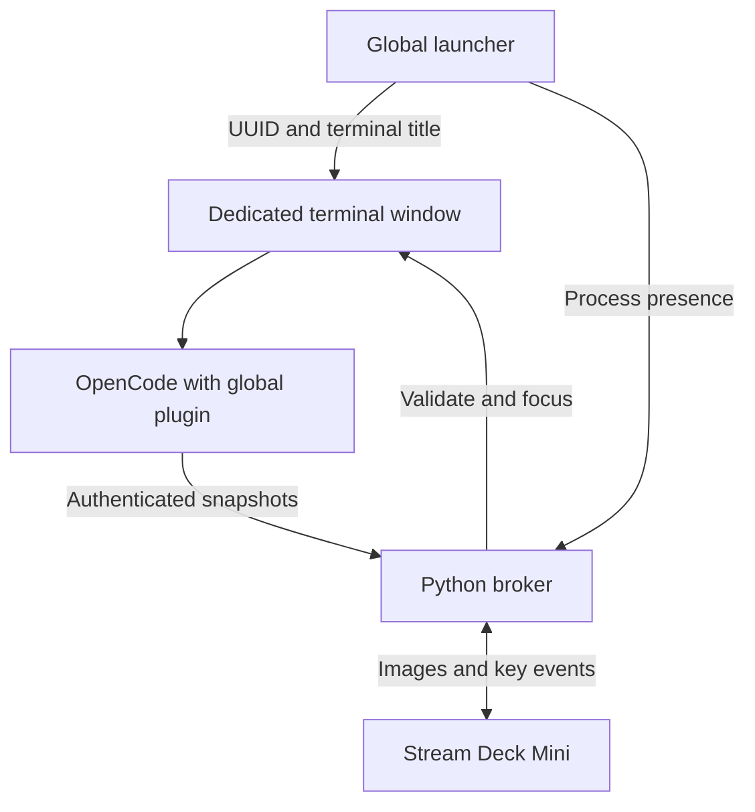

# Implementation architecture

The chosen backend is direct USB HID. No Elgato plugin or MCP connection is necessary. Elgato must release the Mini through its per-device setting.

`common.py` implements atomic files, endpoint discovery, authenticated requests, and PID + process-creation identity. `model.py` owns assignments behind a reentrant lock. `broker.py` uses a bounded threaded HTTP server, a separate USB render thread, and a focus queue. The main loop checks process existence every 500 ms. Live process identity is rechecked at focus time.

`launcher.py` records a unique launch JSON, opens a Windows Terminal window with a unique fixed title and suppresses application title changes. Its worker runs the original OpenCode via a PowerShell script that reads arguments from JSON. It publishes its own verified process identity, watches the foreground command end, and unregisters. The plugin reads the worker binding. First runtime claims that binding to avoid nested inherited launches impersonating the parent.

The conventional server plugin aggregates sessions in the independently owned runtime. It keeps unresolved permission/question ID sets, treats busy and retry as running, and gives pending requests priority over idle. It periodically reconciles through SDK snapshot methods when exposed. Each producer sends a complete state snapshot every two seconds and on relevant events. Registration is idempotent. A broker restart is recovered by re-registering and sending the full snapshot, including pending requests retained in the plugin.

The optional TUI plugin reads the current route and synced runtime state. Its source is based on the inspected newer API; installation is explicit through `-PluginMode tui`, updates `tui.json`, and removes the owned conventional server-plugin entry. It does not rewrite JSONC. Do not run both adapters at once. Current compatibility with your installed runtime must be verified; the default adapter is conventional server mode.

The broker's states are off, idle, running, input, and unknown. READY is a device-level appearance only when every slot is empty. It never exists in the registry or steals a slot. Amber LINK ? appears if no trustworthy snapshot arrived in ten seconds. Live but disconnected processes retain their positions; confirmed dead processes are removed. Process IDs are paired with creation timestamps to prevent reuse mistakes.

Each reassignment increments a slot generation. A physical press captures the last submitted assignment and generation; if the slot has since changed, the broker rejects the press. Presses do not change colors or answer prompts. Key-down edges are debounced over 200 ms. Empty and READY keys do nothing.

The USB adapter uses the pinned StreamDeck Mini protocol implementation with a custom transport backed by the pip `hidapi` wheel. This avoids manually downloading a separate hidapi.dll. The original transport implements library methods rather than rewriting the Mini's packet protocol. Images use the library's native conversion including rotation/flip. Device reads and writes share a lock, animation writes are serialized, and cached frames are bounded. Reconnection clears previous render assumptions and redraws the full frame.

`art.py` renders the visual states procedurally with Pillow and a bundled Pillow font. Frames are smooth gradients of brightness rather than rapid on/off flashing. Green includes rotation, idle a subtle glow, input a stronger pulse, READY a cyan checkmark ring. The preview is illustrative: it places all states on the six keys simultaneously to show the artwork; normal READY appears only with zero instances.

The focus adapter uses exact managed-window title matching, restores minimized windows, and tries SetForegroundWindow. A bounded AttachThreadInput fallback always detaches in finally. Success requires GetForegroundWindow to equal the resolved target. There is no fallback that launches a process, cycles states, sends Enter, approves tools, or matches ambiguous project titles. Windows can still deny activation, and this remains a local acceptance gate.

**Known boundaries:** conventional server mode assumes one independent OpenCode runtime per managed terminal; it cannot identify several attached TUIs sharing one server. Pending snapshot method availability varies by SDK, so hot reload during an already pending request needs particular verification. The app is a native Windows desktop installation, not a Docker service. Raw SSH/WSL/container sessions need the explicit host relay described in REMOTE-AND-WSL.md before they are supported.

Snapshot RPC errors or timeouts mark the conventional adapter unknown until a successful reconciliation. Optional snapshot methods absent from an SDK fall back to live event tracking; full hot-reload recovery of preexisting pending requests is then unverified. See the Qwen handoff for version-specific validation.
