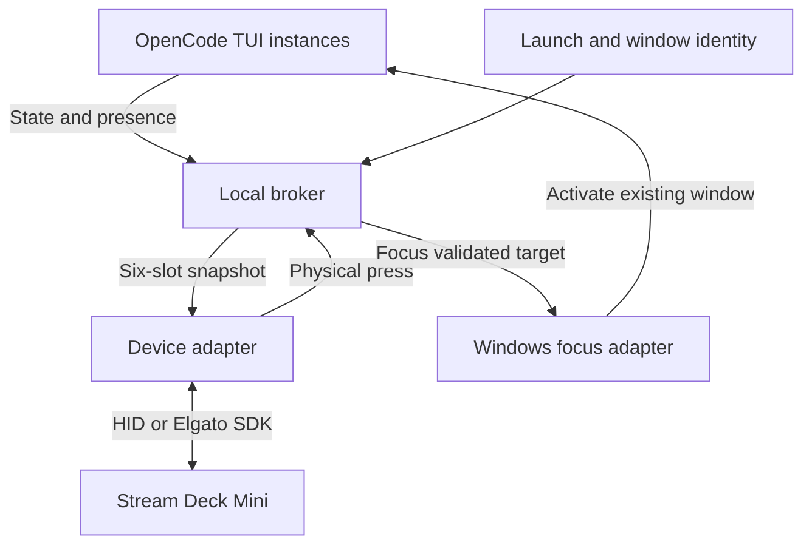

# Stream Deck Mini + OpenCode: feasibility and implementation research

Prepared September 7, 2026 for Ryan. This is a researched design and implementation handoff foundation, not a tested implementation or a diagnosis of uncommitted code.

**Decision.** This is feasible. Use one local broker to own the six slots, receive actual OpenCode state, and route presses to a Windows focus adapter. For a Mini dedicated to OpenCode, the simplest device path is direct HID control after disabling that Mini in Elgato’s application. If the Mini must continue using Elgato profiles, use a thin Elgato plugin with a bundled six-slot profile. Both paths use the same broker and OpenCode adapter.

The critical rules are: one device owner, one button per live TUI instance, state derived from actual runtime facts, and presses that only focus windows. Windows focus and the installed OpenCode plugin capabilities require local validation before declaring success.

**1. What was checked, and what remains unknown**

I searched the web and read Elgato documentation, Microsoft documentation, OpenCode documentation, and OpenCode source. I also inspected the full committed main-branch file tree of [HomeAILab at commit 1b1524d](https://github.com/darkmatter2222/HomeAILab/tree/1b1524dc8ff77e9baefe81c564a99112677bc326). No paths contained `deck`, `opencode`, or `mcp`; a `streamdeck` code search returned no results. This does not rule out differently named code, other branches, or uncommitted local changes. Your Windows working tree and physical Mini were not accessible here.

Before implementation, capture the installed OpenCode version, terminal host/version, Windows versus WSL execution, Elgato version, Mini serial/product ID, actual existing API/MCP package, and local `git status`/diff. Do not overwrite the earlier work before inspecting it. This report assumes a Windows desktop because your launchers and earlier environment use Windows; remote and WSL cases need the host bridge described below.

OpenCode source findings include the development snapshot [ecbc6cc](https://github.com/anomalyco/opencode/tree/ecbc6ccac85b3e8087b6445e584318419b9e2b34). Development-source capability is not proof that your installed release provides it. Pin the implementation to verified local versions rather than silently installing a development build.

**2. The exact behavior contract**

| Situation | Appearance | Button press |
|---|---|---|
| No live OpenCode TUI assigned | Solid black, no text | No operation |
| Live instance, ready for another prompt | Amber, short identity and IDLE | Focus that instance |
| Live instance executing, generating, prefilling, running tools, or automatically retrying | Green, identity and RUN | Focus that instance |
| Unresolved permission or structured question needs a response | Red, identity and INPUT | Focus that instance; do not answer or approve |
| Instance closes or its process dies | Its slot becomes black | No operation |

All six positions are available. Slot order is row-major: top-left through top-right, then bottom-left through bottom-right. Verify the adapter’s physical indexing once with six distinct numbered images. Keep an instance in the same position until it closes; do not compact other slots when one closes. A seventh instance continues running but receives no button, with overflow reported in diagnostics. It must never replace one of the six silently.

Here, an “agent” means a separately launched OpenCode terminal UI. Internal subagents do not each consume a button. Their work and requests may contribute to their owning terminal’s indicator.

“Waiting” needs a precise meaning. A completed answer ending with ordinary prose such as “Would you like me to continue?” is usually still IDLE. A structured question or approval request is INPUT. Do not use an LLM or regex over output text to guess this distinction. Interactive child programs asking on stdin require an additional explicit signal if they are to be supported; native permission/question events do not cover every possible subprocess prompt.

**3. Device ownership: two supported options**

| Option | Elgato app | Custom Elgato plugin | Profiles | Fit |
|---|---|---|---|---|
| A: broker controls Mini over HID | May stay running, with this device disabled | No | Do not govern this Mini while disabled | Dedicated OpenCode Mini |
| B: broker talks to an Elgato plugin | Running and controlling Mini | Yes, small adapter | Bundled OpenCode profile | Mini also used in Elgato ecosystem |
| Official Elgato MCP alone | Running with MCP enabled | Depends on the configured actions | Dedicated MCP Actions surface | Action triggering, not the complete status/display integration |
| Third-party profile-file MCP | Usually edits app files | Package-dependent | Rewrites stored profiles | Setup automation, not a live indicator transport |

Elgato’s stable 7.1 release notes explicitly provide **Preferences > Devices > Enabled (Yes/No)** to release an individual device for third-party control while the app remains open for other devices and virtual decks. This is the supported alternative to having two programs continually overwrite the same Mini. Its persistence across restart must be verified on your installation. [Elgato 7.1 release notes](https://help.elgato.com/hc/en-us/articles/41533810232721-Elgato-Stream-Deck-7-1-Release-Notes)

For option A, Python is reasonable: a local broker, an asynchronous network layer, a Windows focus component, and a device adapter using [python-elgato-streamdeck](https://github.com/abcminiuser/python-elgato-streamdeck). The library is a third-party implementation, not Elgato’s plugin SDK. Pin and verify its support for your product ID. Elgato now documents the Mini’s own HID protocol, including images and key reports. The Mini uses a different protocol from the larger models, so generic Stream Deck report code is unsafe to assume correct. [Elgato Mini protocol](https://docs.elgato.com/streamdeck/hid/mini/)

Option B can use the official Node/TypeScript SDK for the Elgato adapter and Python for the broker. Alternatively, TypeScript throughout avoids a second main runtime, but Windows focusing still needs a suitable native integration. Go is also viable. Language choice is much less consequential than ownership and lifecycle correctness.

**4. Recommended architecture**



For option A, the device adapter is inside the broker and uses HID. For option B, it is an Elgato-managed plugin; Elgato’s app owns HID. Do not run both adapters against this Mini.

This broker coordinates status; it does not proxy model requests. No inference calls, screenshots, token parsing, MCP tools, or AI decisions belong in the ongoing state/focus loop. The broker may live on the same computer as all six OpenCode instances. The hardware and focus components must live on the Windows desktop host even if OpenCode runs in WSL or over SSH.

Use a single broker process, guarded by a per-user lock or named mutex. Bind its API to loopback and require a locally stored random token. A press accepts a known instance identifier, not an arbitrary shell command. Run it at user logon with restart-on-failure, in the interactive user session. A Windows service in Session 0 cannot simply operate the logged-in user’s windows; a service design needs an additional user-session helper. [Microsoft interactive services](https://learn.microsoft.com/en-us/windows/win32/services/interactive-services)

**5. OpenCode integration: choose the adapter from verified capabilities**

The traditional OpenCode plugin is a server-side event hook. Global local plugins load from `~/.config/opencode/plugins/`; project-local plugins load from `.opencode/plugins/`. Resolve the actual config home of the OpenCode runtime, particularly under WSL. Do not install the same bridge through both a project file and global file. [OpenCode plugins](https://opencode.ai/docs/plugins/)

Current development source also has a distinct TUI plugin API. It exposes the current route/session, synced status, pending permissions/questions, events, and a disposal lifecycle. TUI plugins are configured through `tui.json`; they are not automatically interchangeable with conventional server plugins. Separate entrypoints are required for a package targeting both runtimes. [TUI plugin technical reference](https://github.com/anomalyco/opencode/blob/ecbc6ccac85b3e8087b6445e584318419b9e2b34/packages/opencode/specs/tui-plugins.md), [TUI API types](https://github.com/anomalyco/opencode/blob/ecbc6ccac85b3e8087b6445e584318419b9e2b34/packages/plugin/src/tui.ts)

| Installed capability | Implementation choice |
|---|---|
| TUI plugin API verified locally | Prefer a globally configured TUI adapter: it naturally tracks each visible UI and its selected session |
| Only conventional server plugins available | Use a global event plugin plus a launch/window wrapper; enforce one independently owned OpenCode runtime per tracked TUI |
| Known reachable server API but no suitable plugin hook | Launcher registers endpoint and instance; broker subscribes to SSE and obtains snapshots |
| Multiple TUIs attached to one server | Separate per-TUI identity is mandatory; server PID or server URL alone is insufficient |

A normal `opencode` launch starts a TUI and server; running `opencode serve` separately starts another server, not an attachment to the first. The docs expose `/doc`, `/event`, `/global/event`, and `/session/status`. Do not assume every running terminal is at port 4096, or that a plugin’s server URL is always externally reachable without testing. [OpenCode server](https://opencode.ai/docs/server/)

The conventional plugin source includes `serverUrl`, an event hook, and a disposal hook in the inspected development version. Verify them against the installed package before relying on them. A server plugin can initialize for project/runtime contexts and cannot be assumed to represent exactly one terminal UI. [Server plugin types](https://github.com/anomalyco/opencode/blob/ecbc6ccac85b3e8087b6445e584318419b9e2b34/packages/plugin/src/index.ts)

For older builds without observable TUI route changes, tracking “the last session with activity” is only a heuristic. Either implement a verified UI-session binding or explicitly constrain the initial supported mode to one tracked root conversation per launch. Silent guessing here would repeat the earlier failure.

**6. State comes from several facts, not one event**

OpenCode’s status schema uses `idle`, `busy`, and `retry`. It does not provide a single universal `waiting_for_user` status. Maintain unresolved request sets separately. [Status schema](https://github.com/anomalyco/opencode/blob/ecbc6ccac85b3e8087b6445e584318419b9e2b34/packages/schema/src/session-status-event.ts)

| Event or observation | Reducer action |
|---|---|
| `session.status`, status `busy` | Record busy for that session |
| `session.status`, status `retry` | Record automatic retry; green unless input is pending |
| `session.status`, status `idle` | Record idle; do not erase outstanding requests |
| `permission.asked` | Add `properties.id` to permission set for `properties.sessionID` |
| `permission.replied` | Remove `properties.requestID` from that session’s permission set |
| `question.asked` | Add `properties.id` to question set |
| `question.replied` or `question.rejected` | Remove `properties.requestID` from question set |
| `session.error` | Record error detail and reconcile status; do not invent a pending approval |
| Terminal/process exit | Remove live instance and clear slot, regardless of saved conversations |

Request payload field names are confirmed in the inspected [permission schema](https://github.com/anomalyco/opencode/blob/ecbc6ccac85b3e8087b6445e584318419b9e2b34/packages/schema/src/v1/permission.ts) and [question schema](https://github.com/anomalyco/opencode/blob/ecbc6ccac85b3e8087b6445e584318419b9e2b34/packages/schema/src/v1/question.ts). Parse and validate events against the installed SDK. Avoid assuming old event names or flattening a global SSE envelope as if it were a local event.

Suggested reducer, independent of language:

```text
display(instance):
    if instance has no live UI attachment:
        return BLACK
    if its telemetry is not trustworthy:
        return UNKNOWN
    sessions = explicitly owned/selected root sessions and their descendants
    if any session has unresolved permissions or questions:
        return RED_INPUT
    if any session is busy or automatically retrying:
        return GREEN_RUN
    return AMBER_IDLE
```

Keep INPUT red until all applicable requests are resolved. A completion event from an unrelated child must not turn a waiting or running parent amber. Associate descendant sessions through actual parent IDs, never all sessions in the same directory. Track selected session and owned background work separately; if a button represents background activity, its label/diagnostic record should identify that fact.

Internally support UNKNOWN and transport-disconnected states even though the requested normal display has four appearances. Proposed degraded display is amber with `?`, clearly distinct from IDLE. Do not use red for a network outage or preserve an unverified green indefinitely. This is an explicit failure-display proposal, not a redefinition of your normal colors.

Recover pending requests from snapshots after reconnect. The inspected source exposes GET `/permission` and GET `/question`; scope requests to the correct directory/workspace and confirm routes from the installed `/doc`. The TUI adapter can instead read its synced permission/question state. [Permission routes](https://github.com/anomalyco/opencode/blob/ecbc6ccac85b3e8087b6445e584318419b9e2b34/packages/opencode/src/server/routes/instance/httpapi/groups/permission.ts), [Question routes](https://github.com/anomalyco/opencode/blob/ecbc6ccac85b3e8087b6445e584318419b9e2b34/packages/opencode/src/server/routes/instance/httpapi/groups/question.ts)

Snapshot and event delivery are not automatically atomic. Serialize local observations, subscribe before recovery reads, buffer updates, reconcile repeatedly until consistent, and retain UNKNOWN while an authoritative recovery is incomplete. Do not claim exactly-once delivery or an atomic multi-endpoint snapshot. The status map can omit idle sessions in the inspected implementation; absence alone is not evidence of process death. [Status implementation](https://github.com/anomalyco/opencode/blob/ecbc6ccac85b3e8087b6445e584318419b9e2b34/packages/opencode/src/session/status.ts)

**7. Instance identity and broker protocol**

Create a fresh UUID for each TUI launch. A useful record is:

```json
{
  "instanceId": "random-launch-uuid",
  "process": {"pid": 12345, "startTime": "verified-process-creation-time"},
  "uiAttachmentId": "per-tui-identity",
  "directory": "C:\\Users\\ryans\\source\\repos\\HomeAILab",
  "sessionId": "selected-session-or-null",
  "focusTarget": {"kind": "windows-terminal-window", "opaqueId": "validated-host-record"},
  "producerEpoch": "new-on-adapter-restart",
  "sequence": 42,
  "status": "idle",
  "pendingPermissionIds": [],
  "pendingQuestionIds": []
}
```

This is a proposed bridge schema, not an OpenCode API payload. The broker validates process/window metadata locally; it does not trust a submitted PID or HWND blindly. Pair PIDs with process creation time to prevent reuse errors. Do not persist a live assignment across reboot without revalidation.

Suggested custom endpoints:

| Endpoint | Purpose |
|---|---|
| `POST /v1/instances/register` | Idempotently establish a live attachment and slot |
| `PUT /v1/instances/{id}/snapshot` | Replace normalized state with newer producer sequence |
| `POST /v1/instances/{id}/heartbeat` | Renew presence; return broker epoch |
| `DELETE /v1/instances/{id}` | Best-effort explicit detach |
| `GET /v1/display` | Desired six-slot frame and revisions |
| `WS /v1/deck` | Full snapshots, incremental updates, adapter health, presses |
| `POST /v1/focus` | Focus known instance plus expected slot generation |
| `GET /v1/diagnostics` | Desired state, last submitted rendering, liveness, focus evidence |

Use monotonically increasing sequences within a producer epoch. Reject stale updates and old-epoch messages. Slot reuse increments a generation. A delayed press for the previous generation must not focus the new occupant. A broker restart changes its epoch; clients re-register with complete current snapshots. Render writes are serialized per key so a slow old red render cannot overwrite a newer amber one.

Use pushed state changes for normal operation and a lightweight presence heartbeat, for example every two seconds with a ten-second lease. These are suggested initial values, not vendor requirements. Local process-exit observation should clear the slot immediately. A lease timeout is evidence of lost contact, not proof that a process is dead: probe the exact process identity, retain UNKNOWN while resolving ambiguity, and clear when the UI is confirmed gone. Retry bridge connections without delaying OpenCode’s model/tool execution.

**8. Startup and recovery, including the reset problem**

For direct HID mode:

1. During setup, identify the Mini and disable that individual device in Elgato’s app. Confirm the choice survives app restart and reboot.
2. At Windows user logon, start one broker. Its in-memory instance registry begins empty.
3. When the selected device appears, open it and explicitly upload six black images. Do not assume a function called `reset` means “clear to black”; the Mini protocol also has a boot-logo command.
4. Attach the key callback and render live registrations as they arrive.
5. On USB reconnect, invalidate the render cache and upload the complete desired frame.
6. On broker restart, obtain fresh registrations before showing active colors. On graceful shutdown, black out the keys when possible. A process crash cannot execute cleanup; restart supervision performs recovery.

For Elgato-plugin mode:

1. Build/export a Mini profile containing six instances of your slot action, with persisted settings `slot: 0` through `slot: 5`.
2. Bundle the profile with the plugin and register it in the manifest. Make it the device’s default through the app. Remove competing application associations for this dedicated profile use.
3. When Elgato starts the plugin or the Mini connects, request the bundled profile, bind newly appearing action contexts, and obtain a full broker snapshot.
4. Default artwork is black. On `willAppear`, replace cached visuals with a current complete rendering. On `willDisappear`, forget that context. Never retain context IDs across app restarts.
5. When the broker returns, rebuild the display from current live attachments. A reconnection must work without restarting OpenCode.

Plugins can switch only to profiles shipped with them, not arbitrary user-created profiles. Profile import/first-use can prompt the user. Do not promise an undocumented API to set any profile as default. [SDK profile guide](https://docs.elgato.com/streamdeck/sdk/guides/profiles/)

Elgato documents the default-profile control and application-associated profile switching in its setup guide. Use that persistent configuration to prevent focus changes from selecting unrelated artwork. [Profile setup](https://help.elgato.com/hc/en-us/articles/33556495589905-Elgato-Stream-Deck-Download-and-use-Profiles)

The SDK explicitly says action context identifiers are not stable across application cycles. Treat them as temporary rendering handles. [Plugin WebSocket reference](https://docs.elgato.com/streamdeck/sdk/references/websocket/plugin/)

The honest boot guarantee is “black once the device owner has initialized, with no old agent assignments restored.” Software launched at logon cannot guarantee black during firmware boot or before it runs. If no startup logo/flicker whatsoever is required, measure that separately on the actual hardware; neither architecture establishes it merely by having a startup task.

**9. Elgato action design that cannot cycle states**

Use one native action state and dynamically draw BLACK, RUN, IDLE, and INPUT images. Elgato supports two native states fully; extra manifest states are not fully supported. Use `setImage` for the visual state and keep the broker’s enum independent. [Keys guide](https://docs.elgato.com/streamdeck/sdk/guides/keys/)

Illustrative action fragment, not a complete manifest:

```json
{
  "UUID": "com.ryansusman.opencode.slot",
  "Name": "OpenCode Instance",
  "Controllers": ["Keypad"],
  "DisableAutomaticStates": true,
  "DisableCaching": true,
  "UserTitleEnabled": false,
  "SupportedInMultiActions": false,
  "States": [{"Image": "images/black", "Title": "", "ShowTitle": false}]
}
```

`DisableAutomaticStates` prevents the native press toggle; `DisableCaching` controls image caching. Render identity and state into one image to avoid a stale title surviving an otherwise black key. Test startup behavior with the installed Elgato version. [Manifest reference](https://docs.elgato.com/streamdeck/sdk/references/manifest/)

```text
onWillAppear(action, settings):
    validate settings.slot is one of 0..5
    bind temporary action context to slot
    draw current full image, or black while unbound

onKeyDown(action):
    capture rendered instanceId and slotGeneration
    if no occupant: return
    broker.requestFocus(instanceId, slotGeneration)
    # Never increment state, toggle a setting, send a prompt, or launch OpenCode.

onWillDisappear(action):
    forget this temporary action context
```

Use one physical press edge only. Handling both down and up as actions can create duplicate focus requests. Apply the equivalent edge handling to HID reports.

**10. Windows foreground focus is a separate engineering problem**

An OpenCode PID is not necessarily the window-owning PID. Windows Terminal may host multiple tabs/panes; WSL has separate process identities. The robust initial configuration is one OpenCode TUI in each dedicated Windows Terminal window, with a unique launch token and validated window handle. This is a proposed initial supported mode, not a claim that you currently use separate windows.

A launcher can create named windows and preserve a unique title with `--suppressApplicationTitle`. Microsoft also documents `focus-tab --target` and pane focus commands. Tab indices change when tabs move or close. `wt -w NAME` alone defaults to creating a tab; it is not a pure “focus existing instance” command. A missing named window may be created, so pressing a stale button must never fall through to that behavior. [Windows Terminal CLI](https://learn.microsoft.com/en-us/windows/terminal/command-line-arguments)

```text
focus(instanceId, expectedGeneration):
    record = broker.resolve_current_assignment(instanceId, expectedGeneration)
    if absent or process identity has exited: return STALE
    target = host.resolve_and_validate_existing_window(record)
    if ambiguous: return AMBIGUOUS
    if target is minimized: restore it
    request foreground activation using the terminal/Windows adapter
    observe actual foreground window
    if it equals target and required tab/pane is active: return SUCCESS
    return FOCUS_DENIED_OR_WRONG_TARGET
```

Microsoft restricts `SetForegroundWindow` and explicitly allows denial even when documented conditions appear satisfied. A HID callback delivered through an app or broker does not establish guaranteed foreground rights. Use a supported terminal activation mechanism or correctly scoped foreground permission where available, then verify the result. A changed z-order, API invocation, or taskbar flash is not proof of focus. [SetForegroundWindow](https://learn.microsoft.com/en-us/windows/win32/api/winuser/nf-winuser-setforegroundwindow)

The minimum proof is a real press while another application has focus, successful identification of the intended window, and keyboard input reaching that exact terminal. Cover minimized windows and multiple identical project titles. Test tabbed/pane setups separately if you need them. If OpenCode is remote, focus the corresponding local terminal attachment, not a remote PID.

**11. Representative adapter pseudocode**

The functions `bridge`, `observe`, and `readConsistentSnapshot` below are proposed implementation helpers. They are not undocumented vendor APIs, and the snippets are not ready-to-run code.

TUI adapter outline for an installed version verified to support the inspected TUI API:

```typescript
export default {
  id: "ryan.opencode.deck",
  async tui(api) {
    const bridge = createBridgeWithFreshTuiIdentity();
    // Starts reconnects in the background; startup never waits on the broker.
    bridge.start();

    const publish = () => bridge.offerLatest(
      readConsistentSnapshot(api.route.current, api.state)
    );
    const unsubscribers = relevantEventTypes.map(type =>
      api.event.on(type, () => scheduleAfterStateSync(publish))
    );
    // Implement using the pinned runtime's reactive mechanism, or a short
    // local observation timer. Route changes are not necessarily server events.
    const stopObserving = observeRouteAndReadyChanges(api, publish);
    const stopPresence = startHeartbeatAndSnapshotRecovery(bridge, publish);

    api.lifecycle.onDispose(async () => {
      stopObserving(); stopPresence();
      unsubscribers.forEach(unsubscribe => unsubscribe());
      await bridge.closeWithBoundedBestEffortUnregister();
    });
  }
};
```

Fallback server plugin outline:

```typescript
export const DeckBridge = async ({ client, directory, serverUrl }) => {
  const binding = readValidatedLauncherBinding();
  if (!binding) return {}; // Do not create buttons for arbitrary headless jobs.
  const bridge = createNonblockingBridge(binding, client, directory, serverUrl);
  bridge.start();
  return {
    event: async ({ event }) => {
      bridge.enqueueRelevantEvent(event); // bounded queue, fast return
    },
    dispose: async () => bridge.disposeWithDeadline()
  };
};
```

The launcher binding establishes UI identity and focus metadata; the plugin contributes runtime events. Guard against inherited environment variables causing nested headless OpenCode jobs to register as the parent TUI. The launcher must observe the real OpenCode process exit even when a wrapping shell stays open. If the installed hook lacks `dispose`, process observation and lease recovery remain required; do not invent a hook to compensate.

Broker outline:

```text
start:
    acquire single-instance lock
    create new broker epoch
    registry = empty
    start loopback authenticated API
    connect selected device adapter

register(validated attachment):
    reuse assignment only for the same live instance identity
    otherwise allocate lowest free slot; never evict another live instance
    replace facts with current snapshot
    publish new display revision

newer_snapshot(instance, producer_epoch, sequence):
    reject old epochs and sequences
    replace normalized facts atomically
    derive appearance
    publish only changed slots

process_exit(instance):
    invalidate assignment generation
    remove instance
    draw black in its former slot

device_reconnect:
    discard cached render acknowledgments
    transmit complete six-slot desired frame
```

For direct HID, callbacks should enqueue presses into the broker event loop; do not perform network or foreground operations in the device reader thread. Serialize image uploads and cache identical images to avoid unnecessary USB traffic. Query the library/device for its image format instead of hard-coding a format from another model.

**12. MCP: useful, but a different control surface**

Elgato’s documented MCP setup enables a dedicated MCP Actions profile and uses `@elgato/mcp-server` to expose configured actions to compatible clients. It supports stdio and HTTP transports. The guide describes action discovery/activation, not a general physical-key framebuffer plus TUI-presence service. Therefore MCP alone is not a documented replacement for the device adapter. You can leave it enabled for unrelated uses. [Official MCP setup](https://www.elgato.com/us/en/explorer/products/stream-deck/sd-mcp-setup/)

There are unrelated third-party servers with similar names. For example, `verygoodplugins/streamdeck-mcp` edits profile files and describes a quit/write/relaunch cycle to avoid Elgato overwriting them; it also offers a separate USB mode. Those capabilities must not be attributed to the built-in Elgato MCP checkbox. [Third-party project documentation](https://github.com/verygoodplugins/streamdeck-mcp)

Your existing Python/MCP scripts may be valuable test tools. Inspect their package, version, transport, and tool inventory before reusing them. A synthetic MCP action activation can validate a downstream action path, but it does not establish that a physical Mini press was received. Similarly, a successful image command does not prove that the physical screen displays that image.

**13. Plausible causes of the previous failures**

These are hypotheses supported by the interfaces, not findings from your local code:

| Symptom | Plausible cause | Design correction |
|---|---|---|
| Press cycles color | Native multi-state toggle or copied counter handler | One native state; press only invokes focus |
| Buttons reset when Elgato starts | Two device writers or ordinary profile restored | Disable Mini for HID ownership, or use bundled plugin profile |
| Button remains after terminal closes | Saved session mistaken for running UI; server outlives TUI | Per-TUI attachment plus process observation |
| Wrong terminal focuses | Project title/PID used as unique window identity | Launch token plus validated window and terminal binding |
| Red becomes amber too soon | Any idle event overwrites pending request set | Waiting precedence and per-session ownership |
| Stale colors after reconnect | Only event deltas used; cached action contexts reused | Full current snapshot and new context binding |
| Only first project works | Plugin installed project-locally | Verified global runtime configuration |
| One launch consumes several keys | Duplicate installs or project initialization treated as launch | Per-TUI idempotent identity and registration |

**14. Acceptance tests that define completion**

Record exact versions, timestamps, instance UUIDs, process creation identities, slot generations, input events, desired images, rendering submissions, and observed foreground windows. Keep API assertions separate from physical observations.

| Test | Required result |
|---|---|
| Cold reboot, no OpenCode | Six black keys after initialization; no old sessions resurrected |
| Start broker before Elgato, then reverse order | Selected ownership mode works in both orders |
| Launch one TUI at its home screen | Exactly one amber key, before a conversation needs to exist |
| Launch six simultaneously | Exactly six unique stable assignments |
| Launch two in the same directory | Separate buttons and focus targets |
| Generate a long response | Green through prefill and generation, amber on completion |
| Run a long tool without tokens | Remains green |
| Automatic model retry | Green with retry detail; no invented user prompt |
| Request permission | Red until that request is answered/rejected |
| Request structured question | Red until replied/rejected |
| Two pending requests | Resolving one leaves red until the second resolves |
| Child completes while parent runs | Parent remains green |
| Child requires user input | Owning TUI becomes red, without consuming another slot |
| Final answer asks ordinary prose question | Amber unless a real structured request remains |
| Click each of six keys with mixed states | Correct existing instance foregrounded; no state mutation |
| Click a black key | No window, process, command, or state change |
| Press and release / rapid presses | No double execution or color cycling |
| Focus minimized instance from another app | Correct terminal restored and foreground verified |
| Switch conversation inside TUI | Same slot; correct new session binding and status |
| Close OpenCode while shell stays open | Slot clears because OpenCode ended |
| Kill OpenCode or its terminal | Slot clears through process/liveness recovery |
| Reuse OS PID / reuse slot | Old events and presses do not affect new occupant |
| Restart broker while INPUT is pending | Re-register and restore red without a new question event |
| Restart Elgato/plugin | HID remains sole owner, or plugin profile/context mapping recovers |
| Disconnect/reconnect USB | Complete current frame is restored |
| Lock, unlock, sleep, resume | No stale green; correct state recovered after resume |
| Seventh instance | No live assignment stolen; overflow explicit |
| Bridge unavailable | OpenCode continues normally; display does not lie indefinitely |
| Existing MCP tests | Exercise only documented tools; distinguish synthetic and physical tests |

Suggested initial performance targets: normal state updates within 500 ms of observation, physical press to foreground within one second on an unlocked desktop, confirmed local exit cleared within one second, and fallback cleanup within the configured lease/probe window. Measure actual behavior and adjust explicitly; these are engineering targets, not vendor guarantees.

Use deterministic event fixtures for ordering, duplicate delivery, unresolved-request precedence, and slot reuse, plus real OpenCode tool/question/permission runs. A screenshot of the Elgato app is not proof of the hardware display; use physical observation or camera evidence for display validation. Do not report the reboot, USB, or physical-press tests as passed from a simulated API test.

**15. Build order and handoff requirements**

1. Inventory installed versions and existing code. Preserve uncommitted work and establish a reproducible baseline.
2. Prove Mini ownership, six black images, six independently numbered images, and six physical key events without OpenCode.
3. Prove one actual terminal can be focused from a real Mini press while another app is foreground. Resolve Windows restrictions before claiming the final interaction works.
4. Prove real OpenCode status, permission, question, startup, and exit signals on the installed version. Choose the TUI or fallback adapter from this evidence.
5. Connect the components with immutable instance identity and the reducer. Test one instance, then six and simultaneous registration.
6. Add reconnect snapshots, startup configuration, process death handling, and stale-message rejection.
7. Execute the acceptance matrix, retaining evidence of failures and fixes.

The eventual goal prompt should require implementation, installation into the actual global runtime, automatic startup, and evidence for the full matrix. It should prohibit success claims based only on compilation, mocked colors, synthetic button calls, or screenshots of desired state. It should explicitly name any unverified local-version capability and require discovery instead of invented APIs.

For your stated dedicated-Mini use, start with **global OpenCode adapter + local Python broker + direct HID ownership + Windows focus adapter**. Retain the Elgato-plugin design as the supported alternative when you want Elgato to continue owning this Mini. The physical controls are simple; reliable identity, ownership, and recovery are what make them stay simple after a reboot.
